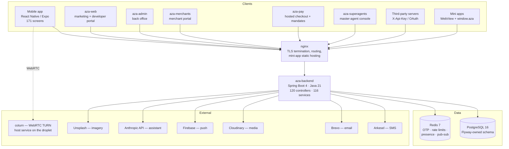
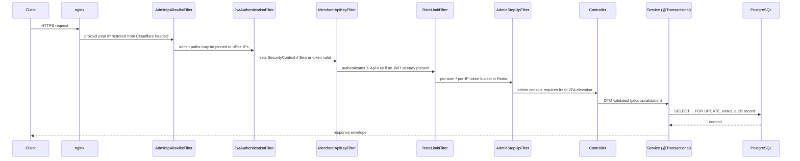
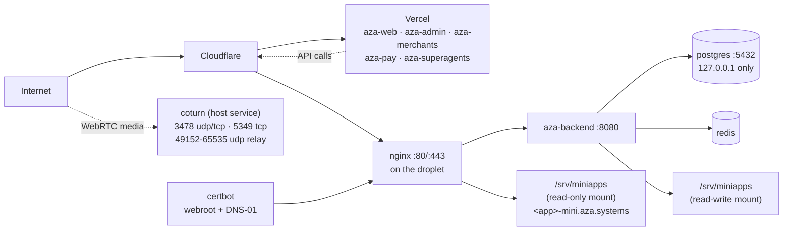
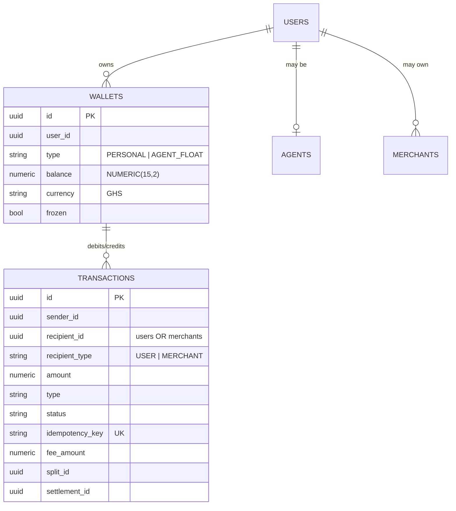
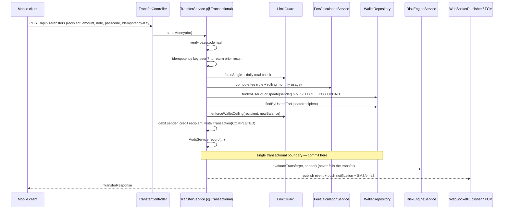

# 4. System Architecture

## 4.1 Overview

AZA is a **monorepo containing eight deployable artefacts** plus a shared mini-app SDK.
All clients speak to one backend over HTTPS/WSS; the backend owns the only database.



## 4.2 Deployable components

| Deployable | Purpose | Public host | Port |
|---|---|---|---|
| `backend` | The entire API, WebSocket broker, schedulers | `api.aza.systems` | 8080 |
| `aza-web` | Marketing site, blog, legal pages, developer portal, API explorer, OAuth consent screen, public `/pay/[handle]` and `/verify` pages | `aza.systems`, `www.aza.systems` | 3000 |
| `aza-admin` | Back office: 40+ operational areas (KYC, disputes, float, risk, reconciliation, filings) | `admin.aza.systems` | 3001 |
| `aza-merchants` | Merchant self-service: API keys, products, invoices, payouts, settlements, webhooks, Connect, mandates, team, mini-app submission | `merchants.aza.systems` | 3001 |
| `aza-pay` | Hosted checkout `/c/[sessionId]` and mandate approval `/m/[mandateId]` | `pay.aza.systems` | 3002 |
| `aza-superagents` | Master-agent console: downline, float distribution and recall, reconciliation, sub-agent invitation | `superagents.aza.systems` | 3003 |
| `aza` | Consumer mobile app | App Store / Play Store (EAS) | — |
| `nginx` | TLS, reverse proxy to the backend, static mini-app bundle serving | :80 / :443 | — |
| `postgres`, `redis`, `certbot`, `coturn` | Supporting infrastructure | internal / UDP relay | — |

> **Hosting note.** The five Next.js apps are *defined* as Compose services (so the whole
> stack can be brought up on one machine) but are *deployed* to Vercel in production; the
> droplet runs the API, the database, Redis, nginx, the TURN relay and the mini-app
> bundles. See §4.6.

**`aza-superagents` is now delivered, and the earlier draft of this chapter said otherwise.**
At the August audit it was an empty scaffold with no `src/`, and — more consequentially —
the backend it needed had been removed: `SuperAgentService` was gone and `Agent.Tier.SUPER`
referenced nothing, which is what made money invariant 8 vacuous (§12.3b). Both halves were
built in `d35b9b59`. Report the sequence, not just the endpoint: an invariant that governed
no live code was the *symptom* that located the missing tier, which is a small but real
argument for writing invariants down before the code that satisfies them exists.

## 4.3 Backend internal architecture

The backend is a **layered monolith** — deliberately, not accidentally. Justify it: a
single transactional boundary across wallet, transaction, hold and split writes is exactly
what a microservice split would have destroyed, and the team size does not justify
distributed-transaction complexity.

```
com.aza.backend
├── controller/    120 — HTTP surface. Thin: validate, resolve principal, delegate.
├── service/       116 — business logic + transaction boundaries (@Transactional here).
│                        Includes WalletLedger, the single place a balance changes (§5.5).
├── repository/    110 — Spring Data JPA; custom @Lock/@Query for money-safe reads.
├── entity/        111 — JPA entities. Schema is Flyway's; entities only validate against it.
├── dto/           259 — request/response records, grouped by domain (auth, transfer,
│                        chat, merchant, connect, split, mandate, miniapp, kyc, …).
├── security/          — JWT filter, merchant API-key filter, rate-limit filter,
│                        admin IP allowlist, admin step-up 2FA, behavioural detection,
│                        request fingerprinting, IP reputation, challenge (hCaptcha).
├── websocket/         — STOMP config, auth interceptor, chat + call handlers,
│                        Redis subscriber for cross-instance fan-out.
├── scheduler/       9 — auto-payout, back-office jobs, bill reconcile, held-transfer
│                        timeout, history cleanup, hold expiry, location retention,
│                        recurring splits, red-envelope expiry.
├── config/            — SecurityConfig, WebSocketConfig, RedisConfig, RedisPubSubConfig,
│                        FirebaseConfig, AsyncConfig, CircuitBreakerConfig, OpenApiConfig,
│                        JacksonConfig, AdminBootstrapRunner.
├── exception/         — AppException + global handler → uniform error envelope.
└── util/              — EmailService, SmsService, RateLimitService, helpers.
```

### Request pipeline



Filter ordering is defined in `backend/src/main/java/com/aza/backend/config/SecurityConfig.java`.
Two ordering decisions are worth calling out in the thesis:

1. `RateLimitFilter` runs **after** `JwtAuthenticationFilter` so it can read the
   `SecurityContext` and apply per-user (not just per-IP) limits.
2. `MerchantApiKeyFilter` runs **after** the JWT filter and skips if a valid JWT already
   authenticated the request — so a merchant portal user and a server-to-server integration
   share one controller surface without ambiguity about which principal is acting.

## 4.4 Authentication surfaces

The platform has **four distinct principal types**, which is unusual and worth a figure:

| Principal | Credential | Filter | Typical caller |
|---|---|---|---|
| User | JWT access token (15 min) + refresh token (30 days) | `JwtAuthenticationFilter` | Mobile app, hosted pages |
| Staff | JWT with role `ADMIN` / `SUPPORT` / `COMPLIANCE` / `FINANCE`, plus fresh 2FA step-up and optional IP allowlist | `JwtAuthenticationFilter` + `AdminStepUpFilter` + `AdminIpAllowlistFilter` | `aza-admin` |
| Merchant / partner | `X-Api-Key: aza_live_… \| aza_test_…`, optionally scoped (restricted keys) | `MerchantApiKeyFilter` | Third-party servers |
| Third-party app acting for a user | OAuth 2.0 bearer token with granted scopes | `JwtAuthenticationFilter` (token introspection path) | "Sign in with AZA" integrations |

## 4.5 Real-time architecture

- STOMP over WebSocket at `/ws` and `/ws/chat`, authenticated by
  `websocket/interceptor/WebSocketAuthInterceptor`.
- `WebSocketPublisher` is the single publish point for domain events.
- Two delivery modes, chosen by `app.websocket.local-delivery`:
  - **Local delivery (`true`, current production):** events go straight to the local STOMP
    session, skipping Redis. Correct and faster *only* on a single backend instance.
  - **Redis fan-out (`false`):** events are published to Redis and picked up by
    `RedisMessageSubscriber` on every instance, so a recipient connected to another
    instance still receives them. This must be switched on the moment the backend scales
    horizontally — a documented, deliberate scalability trade-off.
- Message size limits: 64 KB text, 512 KB binary (`app.websocket.max-*-message-size`).
- Presence uses a Redis key with a 65-second TTL (`app.presence.ttl-seconds`), with
  `User.lastSeenAt` persisted on offline transitions as the durable fallback.
- **`WebSocketEventLog` — a durable per-user recovery log**, a Redis Stream at
  `aza:events:<userId>`. Pub/sub remains the live transport, because it is the
  lowest-latency way to reach whichever instance holds the socket and replacing it with a
  blocking `XREAD` per connected user would cost a Redis connection and a thread per user.
  The stream sits *behind* it: every durable event is appended first, its entry id travels
  with the event, and a client replays from the last id it saw. Delivery is therefore
  **at-least-once** and clients dedupe on id. This is the fix for a real correctness gap —
  fire-and-forget pub/sub meant anything published while a phone was backgrounded, off
  network or mid-reconnect was simply gone, and the only recovery was a REST re-fetch of
  the single open conversation.
- Voice and video calls are WebRTC (`react-native-webrtc`) with signalling over the same
  WebSocket (`CallWebSocketHandler`, `CallSession`) and a coturn TURN server using
  time-limited HMAC credentials (`turn.secret`, `turn.ttl-seconds`).

### The relay that was signed for but never ran

`turnserver.conf` had been in the tree since the calling work began, and `CallService` had
always handed every client `turn:<host>:3478` and `turns:<host>:5349` signed against
`TURN_SECRET` — but no service ever ran coturn. `docker-compose.yml` went straight from
`redis` to `backend`. Calls could therefore connect **only when the two peers reached each
other directly**, which works on a shared Wi-Fi network and fails behind the symmetric NAT
most mobile carriers use: the call rings, reports itself connected, and sits silent.

This is a good example for the thesis of a defect that is invisible to every test that
exists. Nothing was broken in code — the credentials were correctly signed, the ICE
configuration was correctly delivered, the client correctly attempted the relay. The
missing artefact was a *service definition*, and the only environment that could reveal it
was one where the two peers could not see each other.

Two deployment details follow from how TURN works and are worth recording:

- **Host networking, not bridge.** coturn allocates relay ports across 49152–65535, and
  publishing ~16,000 ports through `docker-proxy` is not practical.
- **The container is present but disabled** (`profiles: ["disabled"]`). The droplet already
  runs coturn as a host service, and the two cannot coexist: both want `:3478` with host
  networking, and the container lost the race — it restarted 201 times before the deploy
  health gate (§10) caught it. The definition is kept rather than deleted because it is the
  migration target; moving TURN into Compose means disabling the host service first.
- `turnserver.conf` is gitignored because it carries `static-auth-secret`, which meant
  nothing in the repository recorded what belongs in it. `turnserver.conf.example` is now
  that reference and documents the three values that must agree across the config, `.env`
  and DNS.

## 4.6 Deployment topology

The repository defines a **full single-host stack** in `docker-compose.yml` (backend, all
five Next.js apps, nginx, Postgres, Redis, certbot, coturn). Production applies an overlay,
`docker-compose.backend.yml`, which disables the web services via a `disabled` profile:
**the DigitalOcean droplet serves `api.aza.systems`, the TURN relay and the mini-app
bundles, and the five Next.js apps are hosted on Vercel.** Both files are always passed
together by the deploy workflow.

Describe both in the thesis — the self-contained compose file is what makes the system
reproducible for a marker, and the overlay is what production actually runs. Every service
is on one bridge network (`aza-network`); only nginx binds public ports; PostgreSQL binds
to `127.0.0.1` only.



Two details worth documenting because they were non-obvious engineering decisions:

1. **The mini-app bundle volume is mounted read-write in the backend and read-only in
   nginx.** The backend extracts uploaded bundles; nginx may serve but never modify them.
2. **certbot uses the `dns-cloudflare` image, not plain certbot.** `certbot renew` replays
   whichever challenge each certificate was issued with. `api.aza.systems` was issued by
   webroot (HTTP-01), but the wildcard covering the mini-app hosts needs DNS-01. The
   `dns-cloudflare` image is a superset — it still carries the webroot plugin — so one
   image renews both. On the plain image the wildcard would silently fail to renew and
   every mini app would go dark ~90 days after launch. The Cloudflare API token must
   therefore persist as a mounted secret (`./secrets`, gitignored) for **renewal**, not
   just issuance.

3. **Each mini app gets its own hostname, one DNS label deep** —
   `<app>-mini.aza.systems`, plus `<app>-mini-preview.aza.systems` for a bundle in review.
   Two independent reasons, both worth stating:
   - **Origin isolation.** Serving every mini app from paths on one host would put all
     third-party code in a single browser origin, letting any mini app read every other
     one's `localStorage`, IndexedDB, cookies and service workers. One origin per app is
     the whole point.
   - **Certificate economics.** Cloudflare Universal SSL covers `aza.systems` and
     `*.aza.systems` — one label deep only. A two-level host such as
     `<app>.miniapps.aza.systems` would require paid Advanced Certificate Manager or a
     grey-clouded record pointing straight at the origin, which this droplet's
     Cloudflare-only firewall would reject. The `-mini` suffix keeps everything inside the
     existing wildcard: no new DNS, no new cost, firewall untouched. Nothing else in the
     zone ends in `-mini`, so an app id can never collide with `api`, `admin`, `pay`,
     `merchants`, `turn`, `www` or `superagents`.

4. **`current` and `preview` are symlinks that `MiniAppBundleService` swaps atomically**,
   so publishing or rolling back a bundle never rewrites a file nginx is mid-read on.

## 4.7 Configuration and secrets

Configuration is environment-variable driven, read through `spring-dotenv` in development
and injected by Compose in production. Secrets that must exist for boot:
`DB_*`, `JWT_SECRET`, `TOTP_ENCRYPTION_KEY`, `CHALLENGE_HMAC_SECRET`,
`PAYMENT_PROOF_HMAC_SECRET`, `CHAT_CONTENT_KEY`, `ARKESEL_API_KEY`, `BREVO_API_KEY`,
`CLOUDINARY_*`, `TURN_SECRET`, Firebase service-account JSON. Rotation procedure is
documented at `backend/docs/SECRETS_ROTATION.md`.

**`CHAT_CONTENT_KEY` is not like the others and the distinction matters operationally.**
Every other secret in that list can be rotated: a new `JWT_SECRET` invalidates live
sessions, a new `TOTP_ENCRYPTION_KEY` requires re-enrolment, and both are recoverable
inconveniences. `CHAT_CONTENT_KEY` decrypts data at rest that has no other copy — rotating
or losing it makes **every existing message on the platform permanently unreadable**, and
no user-held material can recover them (§6.3.0). It requires a key-versioning scheme and a
re-encryption pass before it can ever be rotated, and neither exists yet; §13 records this
as an operational debt.

Base64 of exactly 32 bytes; the service refuses to start on a malformed or wrong-length
value, and warns loudly (rather than failing) when it is absent, so a development stack
holding no real messages needs no secret.

Security-relevant defaults, all of which should appear in the thesis as evidence of a
secure-by-default posture:

| Property | Default | Rationale |
|---|---|---|
| `kyc.auto-verify` | `false` | Auto-verification is a demo-only convenience; must never be on in production. |
| `springdoc.swagger-ui.enabled` | `false` | The raw try-it-out UI has none of the developer explorer's test-mode guards. |
| `springdoc.api-docs.enabled` | `true` | The OpenAPI JSON is public and powers the curated explorer. |
| `springdoc.paths-to-match` | merchant/checkout/developer/oauth only | Internal mobile and admin endpoints are deliberately excluded from published docs. |
| `spring.jpa.open-in-view` | `false` | Prevents lazy-loading outside a transaction and the associated connection-hold pathology. |
| `spring.jpa.hibernate.ddl-auto` | `validate` | Schema is Flyway's; Hibernate may never alter it. |
| `app.jwt.access-expiration-ms` | 900,000 (15 min) | Short-lived access token with refresh rotation. |
| `app.chat.content-key` | *empty* | Absent means "store bodies unencrypted, and say so in the log". Failing to boot would block every development stack for a secret only a real deployment needs; silently storing plaintext would be worse. The warning is the compromise. |
| `app.trusted-proxy-ips` | *empty* | Empty means no forwarded header is ever trusted, so a misconfigured deployment over-restricts rather than allowing IP spoofing. The service warns at boot that every request behind a proxy will share one rate-limit bucket. |


---

# 5. Backend Design and the Money Engine

## 5.1 Domain overview

The backend covers eleven functional domains on one ledger:

| # | Domain | Core entities | Principal services |
|---|---|---|---|
| 1 | **Identity & access** | `User`, `RefreshToken`, `RecoveryCode`, `AccountRecoveryContact`, `BiometricToken`, `StaffRole`, `DeviceBlock` | `AuthService`, `UserService`, `OtpService`, `TotpService`, `TotpEncryptionService`, `BiometricService`, `DeviceService`, `StaffRoleService` |
| 2 | **Wallet & transfers** | `Wallet`, `Transaction`, `PaymentRequest`, `RecurringTransfer`, `BulkTransfer(+Item)` | `WalletService`, `TransferService`, `PaymentRequestService`, `RecurringTransferService`, `BulkTransferService`, `LimitGuard`, `FeeCalculationService` |
| 3 | **Chat & calls** | `Chat`, `ChatMessage`, `MessageCiphertext`, `UserKeyBundle`, `ChatBackup(+Chunk)`, `CallSession`, `HistoryTransfer(+Chunk)` | `ChatService`, `KeyBundleService`, `HistorySyncService`, `CallService`, `PresenceService`, `WebSocketPublisher` |
| 4 | **Merchant acceptance** | `Merchant`, `MerchantApiKey`, `MerchantProduct`, `MerchantInvoice`, `MerchantPayout`, `MerchantSettlement(+Item)`, `MerchantPlan`, `MerchantSubscription`, `MerchantTeamMember`, `MerchantDiscountCode`, `CheckoutSession` | `MerchantService`, `CheckoutService`, `MerchantSettlementService`, `MerchantDiscountService`, `MerchantAlertService`, `WebhookService` |
| 5 | **Marketplace (AZA Connect)** | `ConnectTransfer`, `CheckoutSessionSplit` | `ConnectService` |
| 6 | **Holds (manual release)** | `PaymentHold`, `HoldRecipient`, `HoldEvent` | `HoldService`, `HoldExpiryService`, `HoldLedgerAuditService` |
| 7 | **Agent cash network** | `Agent`, `FloatMovement`, `AgentCommissionSettlement`, `WithdrawalCode` | `AgentService`, `AgentCashService`, `AgentCommissionService`, `FloatService`, `WithdrawalCodeService` |
| 8 | **Social money** | `ExpenseSplit(+Participant)`, `RecurringSplit(+Participant)`, `SplitSettlement`, `RedEnvelope`, `Referral`, `PromoCode(+Redemption)` | `ExpenseSplitService`, `RecurringSplitService`, `RedEnvelopeService`, `ReferralService` |
| 9 | **Bills & budgeting** | `BillPayment`, `Biller`, `Budget` | `BillPaymentService`, `BillForwardingService`, `BudgetService`, `CategorySuggestionService`, `AiService` |
| 10 | **Compliance & risk** | `KycRecord`, `KycTier`, `KybRecord`, `KybDocument`, `FlaggedTransaction`, `RiskAlert`, `RiskDecisionLog`, `ScreeningMatch`, `SanctionsListEntry`, `RegulatoryFiling`, `SafeguardingSnapshot`, `ReconBreak`, `AuditLog`, `AdminAuditLog`, `AuditAnchor`, `PendingApproval` | `KycService`, `MobileKybService`, `RiskEngineService`, `RiskRuleService`, `AnomalyDetectionService`, `ScreeningService`, `ComplianceService`, `RegulatoryService`, `ReconciliationService`, `ApprovalService`, `AuditService`, `AuditAnchorService` |
| 11 | **Developer platform** | `OAuthClient`, `OAuthAccessToken`, `PaymentMandate`, `MandateCharge`, `MiniApp`, `MiniAppConsent`, `MiniAppReport`, `WebhookEndpoint`, `WebhookDelivery` | `OAuthService`, `PaymentMandateService`, `MandateChargeExecutor`, `MiniAppService`, `MiniAppBundleService`, `MiniAppCatalog`, `WebhookService` |

## 5.2 Core data model

### The three balance-bearing account types



**Design decision worth defending in the viva.** `Transaction.recipientId` is a
*polymorphic* reference: it points at either a `users` row or a `merchants` row, and
`recipientType` says which. This was chosen so that a single `transactions` table is the
one authoritative ledger for every kind of value movement — merchant sales, P2P transfers,
agent cash, bill payments and splits all share it. The cost is that no foreign key can be
declared on `recipient_id`, and any query that naively joins it to `users` silently drops
merchant rows. The entity carries an explicit warning comment to that effect
(`entity/Transaction.java:23-29`), and the constraint was later enforced by
`V50__merchant_rail_recipient_type.sql`. Present this honestly as a
normalisation-vs-single-ledger trade-off.

### Wallet types

- `PERSONAL` — every user has exactly one. Uniqueness enforced by
  `wallets_user_id_type_key UNIQUE (user_id, type)`.
- `AGENT_FLOAT` — an agent's ring-fenced float wallet. An agent therefore holds exactly one
  of each, and cash-in/cash-out is an ordinary internal wallet-to-wallet transfer between
  the two.

### Transaction taxonomy

```java
enum TransactionType   { TRANSFER, REQUEST, CASH_IN, CASH_OUT,
                         MERCHANT_PAYMENT, BILL_PAY, PAYOUT, DISBURSEMENT }
enum TransactionStatus { DRAFT, PENDING, COMPLETED, FAILED, CANCELLED,
                         DECLINED, REVERSED, HELD_FOR_REVIEW }
enum TransactionCategory { BILLS, TRANSPORT, FOOD, EDUCATION, ENTERTAINMENT,
                           SHOPPING, HEALTHCARE, SAVINGS, OTHERS }
```

`HELD_FOR_REVIEW` is the interesting one: a HIGH-anomaly transfer is intercepted at
confirmation and parked for a COMPLIANCE officer to release or reject, rather than being
silently blocked or silently allowed.

### Fee model

Fees are data, not code (`fee_rules` + `monthly_fee_usage`, `V23__fee_engine.sql`):

| Field | Meaning |
|---|---|
| `fee_type` / `amount` | `PERCENTAGE` or flat |
| `flat_component` | combined flat + percentage rules |
| `min_fee` / `max_fee` | floor and cap |
| `free_per_txn_threshold` | transactions at or below this are free |
| `free_monthly_threshold` | rolling-monthly free allowance per user per type |
| `effective_from` / `effective_to` | versioned rules; historical fees stay reproducible |

Seeded consumer catalogue:

| Type | Rule |
|---|---|
| P2P transfer | Free up to GHS 100 per transaction and GHS 1,000 per rolling month; 0.5% above, capped at GHS 10 |
| Cash-out (agent) | 1%, minimum GHS 0.50, capped at GHS 15 |
| Cash-in, bill pay, airtime | Free to the consumer (no active rule) |
| Merchant | Priced by **pricing plan**, with an optional per-merchant `fee_rate_bps` override |

Rolling-monthly consumption is tallied per `(user_id, transaction_type, usage_month)` in
`monthly_fee_usage`, keyed `YYYY-MM`, with a uniqueness constraint so concurrent updates
cannot create a second tally row.

#### Merchant MDR joins the fee engine (`V62`)

`V23` gave consumer fees rule versioning, `effective_from`/`effective_to` dating, amount
bands and min/max caps, then left merchant pricing as a per-merchant integer — the comment
in that migration says "for now", and this is what "for now" cost. Merchant pricing had no
versioning, no dating, no bands, no caps, and no way to answer *"what rate was this merchant
on in March?"* from the pricing model at all.

The structural obstacle is worth stating because it is the interesting part: the engine
resolved rules on `transaction_type` alone, and `transaction_type` has no room to express
**who is being charged**. Adding a merchant dimension directly would have meant a rule per
merchant, which is not a pricing model, it is the same integer with extra steps. The
resolution is an intermediate concept — a **pricing plan** — so one `MERCHANT_MDR` rule
prices a whole class of merchants and is versioned like any other rule:

- `merchants.pricing_plan` (default `STANDARD`) says which class a merchant sits in.
  Finance moves merchants between plans through the admin API, **under maker–checker**.
- `fee_rules.pricing_plan` says which plan a rule prices. `NULL` means *any* plan, so a
  catch-all rule can back-stop plans with no rule of their own. A rule written for a
  *different* plan is **never** used as a fallback — pricing a merchant on somebody else's
  negotiated terms would be worse than having no rule at all.
- Rates still differ per merchant three ways: different plans, tier bands *within* a plan
  (so one plan prices a GHS 5 sale and a GHS 50,000 sale differently), and `fee_rate_bps`
  surviving as a per-merchant override that outranks the plan entirely.

**`fee_rate_bps` changes meaning, and the data migration is where the care went.** It is no
longer "this merchant's rate" but "this merchant is an *exception* to their plan", so `NULL`
becomes meaningful rather than missing. Merchants sitting on exactly the standard 150 bps
were never negotiated there — that is just the entity default they were created with — so
they are set to `NULL` and move onto the plan, which means a future change to standard
pricing actually reaches them. Anything on a *different* rate was a deliberate exception and
keeps it to the basis point. A CHECK constraint bounds any override to 0–10,000 bps, with
`NULL` passing, so a direct SQL fix cannot quietly install a 300% MDR either.

The seeded `MERCHANT_MDR — standard` rule is 1.5% with no bands and no caps, deliberately
reproducing the pre-migration behaviour exactly rather than inventing commercial terms in a
schema change. Covered by `MerchantFeeCalculatorTest` (new) and `FeeCalculationServiceTest`.

### KYC tiers and limits

`entity/KycTier.java` — BoG-style tiered e-money limits. **The enum carries an explicit
note that these figures are placeholders to be confirmed against the current Bank of Ghana
directives; reproduce that caveat in the thesis rather than presenting them as regulatory
fact.**

| Tier | Single txn | Daily | Monthly | Wallet ceiling |
|---|---|---|---|---|
| TIER_1 | GHS 1,000 | 2,000 | 6,000 | 5,000 |
| TIER_2 | GHS 5,000 | 10,000 | 30,000 | 20,000 |
| TIER_3 | GHS 25,000 | 50,000 | 200,000 | none |

`LimitGuard` is the single enforcement point, so every money path applies the same caps:

- `singleLimit(user)` — per-user back-office override, else the tier cap.
- `dailyLimit(user)` — same precedence.
- `enforceWalletCeiling(user, newBalance)` — a **credit** is rejected if it would push the
  wallet above the tier's ceiling. This is the control that keeps a low-KYC account from
  being used as a value store, and it is enforced on the receiving side, which is easy to
  forget.

New users start at `TIER_1`; users already verified when tiering was introduced were placed
at `TIER_3` so their limits were not retroactively tightened
(`V27__kyc_tiers.sql`). Users may request an increase (`LimitIncreaseRequest`,
`AdminLimitRequestController`).

## 5.3 The transfer flow



Critical ordering property: **every balance mutation and the ledger record commit inside
one transactional boundary; every external effect (push, SMS, webhook, risk evaluation)
happens outside or after it.** The inverse — firing the external effect and debiting on
callback — is explicitly prohibited.

### Concurrency safety

Balance updates never use read-modify-write in Java. `WalletRepository` exposes explicit
pessimistic-lock finders:

```java
@Lock(LockModeType.PESSIMISTIC_WRITE)
@Query("SELECT w FROM Wallet w WHERE w.userId = :userId AND w.type = …PERSONAL")
Optional<Wallet> findByUserIdForUpdate(UUID userId);
```

and the same for typed wallets and merchants (`merchantRepository.findByIdForUpdate`).
Two parallel transfers from the same wallet serialise on the row lock, so a double-spend is
impossible at the database level rather than at the application level.

**Lock ordering — a finding, and its fix.** Two transfers in opposite directions between the
same pair of wallets deadlock if locks are acquired in request order. The audit found that
`AgentCashService` sorted its identifiers before locking and `TransferService` did not; the
platform now has one shared helper used by both. The history is worth keeping in the thesis,
because the fix is less interesting than how the gap was found.

`AgentCashService` originally got it right on its own:

```java
// service/AgentCashService.java:253
if (agentUserId.compareTo(customerId) < 0) {
    agentWallet    = lockFloat(agentUserId);
    customerWallet = lockPersonal(customerId);
} else {
    customerWallet = lockPersonal(customerId);
    agentWallet    = lockFloat(agentUserId);
}
```

`TransferService` does not. At all four of its lock sites — transfer confirmation
(`:340`, `:468`), held-transfer release (`:581`, `:584`), money-request acceptance
(`:847`, `:849`) and bulk transfer (`:1266`, `:1279`) — it locks the **sender** first and
then the **recipient**, in request order.

*Failure scenario:* A sends to B while B sends to A. Transaction 1 holds A and waits on B;
transaction 2 holds B and waits on A. PostgreSQL detects the cycle and aborts one with
SQLSTATE 40P01, which surfaces to the user as a failed transfer. **No money is lost or
created — invariant 4 still holds** — but an avoidable legitimate transfer fails.

**Fixed.** `WalletLocker` (`service/WalletLocker.java`) now owns the ordering for every money
path, and `AgentCashService`'s private copy was deleted:

```java
public Locked lock(Target first, Target second) {
    if (first.order(second) < 0) {
        Wallet a = lockOne(first);
        Wallet b = lockOne(second);
        return new Locked(a, b);
    }
    Wallet b = lockOne(second);   // lock the lower key first…
    Wallet a = lockOne(first);
    return new Locked(a, b);      // …but hand them back as requested
}
```

Three design points worth a paragraph each:

1. **The sort key is `(userId, type)`, not `userId`.** An agent holds both a PERSONAL and an
   AGENT_FLOAT wallet, so a user id alone does not identify a wallet row. The original
   agent-only version compared user ids, which was safe *there* because the two wallets
   always belonged to different users — but does not generalise.
2. **`Locked` returns the wallets in the order requested**, not the order acquired. Call
   sites never reason about which was locked first, which is what makes the helper adoptable
   rather than a new source of bugs.
3. **One implementation, not two.** Two copies of the same invariant is how a fix drifts
   back out.

Applied at all four `TransferService` sites and both `AgentCashService` paths, and proven by
`WalletLockerTest` (7 tests) plus
`ConcurrentTransferIT.bidirectionalTransfers_doNotDeadlock`, which drives 60 alternating
A→B / B→A transfers in parallel against real PostgreSQL and asserts zero deadlock aborts.

**A subtlety the test surfaced, worth reporting:** `UUID.compareTo` compares the high 64
bits as a **signed** long, so `ffffffff-…` sorts *before* `00000000-…`. It is not byte
order. This does not matter — any total order prevents deadlock, provided every caller uses
the same one — but it is a clean example of an assumption that reads as obviously true and
isn't. A dedicated test pins it.

Full write-up as **Finding F1** in `05-limitations-glossary-and-appendices.md`. This is good thesis material
precisely because the correct pattern already existed elsewhere in the same codebase: it
demonstrates why an invariant needs a mechanical review gate rather than developer memory.

### Idempotency

`Transaction.idempotencyKey` carries a `UNIQUE` constraint. For tenant-facing surfaces the
key is scoped to the tenant, not global:

- `checkout_sessions`: scoped per merchant (`V43__scope_checkout_idempotency_per_merchant.sql`)
- `connect_transfers`: `UNIQUE (merchant_id, idempotency_key)`

This was a real defect class: a globally-unique key lets one integrator's key collide with
another's and return the other tenant's result.

**Verified: the `AgentCashService` gap flagged by the June 2026 audit is now closed**, by a
different mechanism worth documenting, because the codebase deliberately uses *two* valid
approaches:

| Approach | Where | Mechanism |
|---|---|---|
| **Scoped key** | Checkout (V43), Connect (`UNIQUE(merchant_id, idempotency_key)`) | The tenant is part of the uniqueness constraint, so two tenants may independently reuse the same key value |
| **Global key + ownership guard** | `AgentCashService:56` | One global namespace; a replay by a different principal is rejected at read time |

```java
// service/AgentCashService.java:56
if (existing.isPresent()) {
    // Ownership guard: keys are globally unique across the transactions table,
    // so a replayed key must belong to THIS agent's cash-in (agent is sender)
    // or it would leak another user's transaction details.
    if (!existing.get().getSenderId().equals(agentUser.getId())) {
        throw new AppException("INVALID_IDEMPOTENCY_KEY", "Invalid idempotency key", HttpStatus.CONFLICT);
    }
    return toResponse(existing.get(), agentForUser(agentUser));
}
```

Scoped keys are the better choice where integrators pick their own key values — they *will*
collide across tenants. The ownership guard is adequate where the key namespace is already
effectively unique. Present the trade-off rather than treating either as the single correct
answer.

## 5.4 The financial invariants

These nine invariants are the platform's written contract for money code. They are the
core of the correctness argument in the thesis, and they are enforced by a documented
review gate (`.claude/skills/money-path-review/SKILL.md`).

**All nine now hold unconditionally.** That sentence is worth less than the two paragraphs
explaining how they got there, so lead with the movement: at the August audit six held
unconditionally, two held with a documented qualification, and one governed no live code.
The remaining work was not writing new features that happened to satisfy the rules — it was
using each rule as a search query against the codebase, which is what turned up the three
wallet writers that took no lock (§5.4a), the mint path that could double-count a bank
deposit (V60), and the withdrawal endpoint that debited on every retry (V61).

Re-verified **2026-09-06** at commit `9678fa5a`. The 2026-08-21 column is retained because
the movement between the two columns is the evidence, not the final state.

| # | Invariant | Failure mode it prevents | 2026-08-21 | 2026-09-06 |
|---|---|---|---|---|
| 1 | **Balanced movement.** Every credit has a matching debit in the same transaction. | Money created from nothing. This is the audit finding that motivated the framework: a withdrawal flow that credited a destination and never debited the wallet. | ✅ Holds | ✅ Holds — now structurally, via `WalletLedger.transfer` |
| 2 | **Debit before external effect.** The wallet debit commits before (or atomically with) any push, webhook or provider call. | Money leaving on a callback that never arrives, or arriving twice on a replayed one. | ✅ **F2 fixed** | ✅ Holds |
| 3 | **Tenant-scoped idempotency.** Every money-moving endpoint takes an idempotency key, scoped to the tenant. | Duplicate charges on client retry; cross-tenant result leakage. | ✅ Holds | ✅ Holds — **three gaps closed**: user withdrawals (V61), recurring transfers, float mint/burn (V60) |
| 4 | **Concurrency-safe balance updates.** Row locking or atomic DB updates, never read-modify-write in Java. | Double-spend under concurrency. | ✅ **measured**, F1 fixed | ✅ Holds — **three unlocked writers found and closed** by `WalletLedger` (§5.4a); payment approvals and reversals now lock too |
| 5 | **`BigDecimal` only.** No `double`/`float` near an amount; amounts validated positive, non-null, in range at the boundary. | Silent rounding loss; negative-amount transfers. | ✅ grep-verified | ✅ Holds — asserted at schema level by `MigrationChainIT`, which no longer flags boolean columns |
| 6 | **AuthZ + passcode.** Consumer money flows verify the 4-digit passcode; admin money ops go through maker–checker; merchant/partner ops check API-key scope and ownership. | A single admin moving funds alone; acting on another tenant's wallet by ID. | ✅ Holds | ✅ Holds — extended to float distribution (`ROLE_SUPER_AGENT` + passcode) and to merchant pricing changes (maker–checker) |
| 7 | **Product scope.** GHS-only, Ghana-only, internal rails. Any multi-currency or FX path is a finding. | Unbounded scope creep into unregulated territory. | ✅ grep-verified | ✅ Holds |
| 8 | **No margin on float distribution.** SUPER-tier float distribution is an internal transfer with no fee or markup. | An agent hierarchy quietly becoming a fee cascade. | ⚠️ **Vacuous — F3** | ✅ **Holds — F3 closed.** `SuperAgentService` built; `SuperAgentServiceTest` (17 tests) |
| 9 | **Audit trail.** Every movement writes its ledger record inside the same transaction, with enough metadata for reconciliation. | Unreconcilable breaks; unprovable disputes. | ✅ Holds | ✅ Holds — `float_distributions` adds a ledger for the new movement type |

### Finding F2 — external effects fired *before* commit (fixed)

Invariant 2's ordering was correct: the debit, credit and ledger write all preceded the
notifications. But the notifications were issued **inside** the `@Transactional` method, so
they went out before the transaction committed:

```java
// service/TransferService.java:429 onward — still inside @Transactional
transactionRepository.save(transaction);
riskEngineService.evaluateTransfer(transaction, sender);
webSocketPublisher.publishNotification(...);
notificationService.sendMoneyReceivedNotification(...);
emailService.sendTransferSentEmail(...);
smsService.sendTransferSentSms(...);
```

*Failure scenario:* any exception after this point — or a failure at commit — rolls the
transfer back while the recipient has already had a push, an SMS and an email announcing
money that never arrived. The dangerous direction (money moves, no record) is prevented;
this direction is not. Holding the transaction open across four provider calls also
lengthens the window in which the wallet rows stay locked.

**The fix already existed in this codebase**, in the chat path — `ChatService.runAfterCommit`,
with exactly the right rationale in its comment. It has been generalised into
`AfterCommitExecutor` and applied to all four effect blocks in `TransferService` (merchant
payment, P2P transfer, released hold, accepted money request).

Three decisions in that fix are each a real trade-off worth explaining:

1. **Only genuinely external effects were deferred.** `riskEngineService.evaluateTransfer`
   and `feeCalculationService.recordMonthlyUsage` write to AZA's own tables and stay
   *inside* the transaction alongside the ledger record — invariant 9 requires exactly that.
   Invariant 2 governs effects that leave the building.
2. **Reads stay inside; only sends are deferred.** Notification preferences and the merchant
   owner are fetched while the entities are still managed, and balances are captured into
   locals before the lambda. Deferring the reads too would work, but would open a second
   transaction per notification.
3. **Failures in the deferred action are logged and swallowed.** The money has moved and the
   transaction is closed; throwing would produce an error no caller can act on. A failed SMS
   must not be able to look like a reversal.

Proven by `AfterCommitExecutorTest` (5 tests), including
`neverFires_whenTheTransactionRollsBack` — the exact failure the component exists to prevent.

Use this in the discussion chapter: the chat path got it right and the money path did not,
in the same codebase by the same authors — an invariant that is *understood* is not the same
as an invariant that is *enforced*.

### Finding F3 — invariant 8 governed code that no longer existed (now closed)

**At audit.** `SuperAgentService` had been removed from `backend/src/`. `Agent.Tier.SUPER`
was declared but referenced nowhere in `service/` or `controller/`. The surviving float
code, `FloatService`, contained no fee, commission, margin or bps logic at all — only
`mint`, `burn` and `list`.

The invariant was therefore **vacuous**: there was no float-distribution path for it to
govern. It was not violated; there was nothing to violate. The instinct to quietly drop it
and report nine-for-nine is exactly the instinct the method exists to resist — and, as it
turned out, dropping it would have discarded the one signal that located a missing tier.

**Closed (`d35b9b59`).** Both halves are now built: the backend money path and the
`aza-superagents` console that drives it. The invariant governs live code and is enforced
by tests.

`SuperAgentService` is the money path, and each of its guarantees maps to an invariant
above rather than being invented for the occasion:

- **No e-money is created.** A distribution is an internal `AGENT_FLOAT` → `AGENT_FLOAT`
  move, so the safeguarding invariant (§5.5) is untouched — issued e-money and the
  safeguarded balance both stay exactly where they were. This is the whole reason the tier
  can exist without a finance step for every till.
- **Strictly no margin (invariant 8).** The amount that leaves the master's float is the
  amount that lands in the sub-agent's: no fee, no spread, and no commission accrual on
  either side. Commission remains a matter between AZA and whichever agent served the
  customer, which is what stops a hierarchy from becoming a fee cascade.
- **Locking through `WalletLocker` in canonical order (invariant 4)**, with the ledger row
  and the `Transaction` written in the same transaction (invariant 9).
- **Three independent gates (invariant 6):** `ROLE_SUPER_AGENT`, derived per request from an
  ACTIVE agent of tier SUPER exactly as `ROLE_AGENT` is; `requireActiveSuper` inside the
  service; and the operator's passcode before any balance changes. Every read and write is
  scoped to the caller's own downline.
- **Idempotency keys are required, not optional (invariant 3)**, and scoped to the master —
  a key belonging to someone else is refused rather than replayed, which is the same
  cross-tenant rule V43 established for checkout. Under concurrency the UNIQUE index is the
  real arbiter: the loser's whole transaction rolls back, wallet updates included.

Two design decisions are worth defending explicitly in the thesis:

1. **Inviting a sub-agent files a PENDING application with the parent set; staff
   maker–checker still activates it.** A master cannot put its own recruit live. The
   alternative — letting a master onboard directly — would make the KYC gate delegable to
   the party with the least incentive to apply it.
2. **Adopting an existing agent is deliberately unsupported**, which is also what makes a
   parent cycle impossible. `V58` carries a CHECK against the degenerate self-parent, but a
   database constraint cannot see a longer cycle (A→B→A); making the parent write-once at
   creation removes the class of problem instead of policing it. Where a longer chain *is*
   visible — in `SuperAgentService`, which walks it — the check is enforced anyway.

`V58` also widens `transactions_type_check` for `FLOAT_DISTRIBUTION`. Note the trap, since
the thesis has now hit it twice from opposite directions: that CHECK enumerates the
`TransactionType` values that existed when the column was created, so **the first
distribution on any non-empty database would have been rejected** without this. `V64`
(§6.7) is the same trap on `transactions.status`, found the hard way in production.

The review method is: map each changed endpoint to its flow, trace
`validation → authZ/passcode → idempotency → debit → credit → record → external effects`,
and **actively construct the failure scenario** (duplicate request, concurrent request,
crash between debit and credit, callback replay, negative amount, someone else's wallet ID)
rather than reading for plausibility. Severity is CRITICAL if money is lost, created or
duplicated; HIGH for authZ or idempotency gaps; MEDIUM for audit/validation gaps.

## 5.4a `WalletLedger` — making the lock impossible to forget

The single most consequential backend change since the audit, and the one with the most
transferable lesson.

**The situation.** Invariant 4 was verified as holding, and it did — every path the audit
traced took a `PESSIMISTIC_WRITE` lock before touching a balance. But the invariant was
enforced *by every author remembering to enforce it*. Twenty files each carried their own
copy of:

```java
wallet.setBalance(wallet.getBalance().add(amount));
walletRepository.save(wallet);
```

**Three of those twenty never took the row lock first.** That is the classic
read–modify–write race: two concurrent requests read the same balance, both compute from
it, and one of the two writes vanishes — money created or destroyed depending on the sign.
The audit did not find them because the audit traced the *documented* money paths, and
these were not on them; they were the promo credit, the referral reward, and float
mint/burn.

**The fix is structural rather than local.** Routing every balance change through
`WalletLedger` means the lock is not something a caller *can* forget: the only way to move
a balance is to call a method that has already taken it. Fixing the three unlocked writers
individually would have restored the invariant for exactly as long as it took someone to
write a twenty-first path.

The class draws two boundaries that are worth defending, because both are places where the
obvious design is wrong:

1. **`credit`/`debit`/`transfer` take the lock; `*Locked` variants do not.** Some callers
   must lock a wider set of rows in one go — a wallet plus a merchant, say — and have
   therefore already taken the wallet lock as part of that set. Forcing them through the
   locking entry point would mean re-locking a row they hold, and forbidding them would
   push them back to hand-rolled arithmetic. The `*Locked` variants assert nothing about
   locking and exist so those callers still share the arithmetic, the validation and the
   audit write. Two-sided operations go through `WalletLocker`'s canonical ordering so they
   cannot deadlock against each other (this is finding F1's fix, now unavoidable rather
   than merely available).
2. **Frozen-wallet policy stays with the callers.** An ordinary transfer must refuse a
   frozen wallet; an admin reversal crediting a frozen wallet is the entire *point* of the
   reversal. Passcode, limits, idempotency and authorization are likewise the caller's
   business. `WalletLedger` is the last mile, not the gate — a distinction worth making
   explicitly, because the temptation with a chokepoint class is to keep adding policy to
   it until it needs to know who is calling and why.

**A denormalisation removed at the same time (`V59`).** `users.balance` was a copy of the
user's PERSONAL wallet balance, written alongside `wallets.balance` by most money paths and
silently skipped by others — including, as it happens, the same three: the referral reward,
the promo credit, and float mint/burn. Anything reading it could be told a stale balance,
and the mini-app SDK's balance endpoint was doing exactly that. Once there is one place a
balance changes, a second copy of it is not a cache but a second source of truth, so the
column is dropped and the SDK endpoint reads the wallet.

The migration carries the rollback note explicitly, which is the kind of operational
honesty the thesis should show rather than describe: rolling back past the release that
removed the entity field restores a column that starts at 0 for everyone, and the balances
it would then report are wrong. Roll forward instead.

Covered by `WalletLedgerTest` (14 tests, 97% line coverage), `ApprovalLockingTest` and
`TransactionReversalTest` — the latter two because payment approvals and transaction
reversals were themselves reading and writing balances without pessimistic locking
(`4cec45d8`).

### Three idempotency gaps found by re-reading invariant 3

Reported together because they share a shape: each is an endpoint that moves money and had
no key, and in each case the reason it had none is instructive.

| Gap | What a retry did | Fix |
|---|---|---|
| **Float mint (`V60`)** | Nothing stopped the same bank deposit being minted twice: `bank_reference` carried no constraint and the service did no duplicate check. Two mints citing one deposit put **issued e-money above the safeguarded balance** — the exact invariant that table's own header comment claims to protect. | `UNIQUE (type, bank_reference)`. The pair rather than the reference alone, because a mint and a later burn may legitimately cite the same bank transaction when a deposit is returned. |
| **User withdrawal (`V61`)** | Requesting a withdrawal *reserves* the funds — it debits immediately. A double-submitted request (retry, double tap, flaky connection) debited twice and left two PENDING rows. | `UNIQUE (user_id, idempotency_key)`, scoped per user. A **global** unique key would let one account's retry collide with another's and hand back somebody else's withdrawal — the cross-tenant leak V43 fixed for checkout. |
| **Recurring transfers** | Execution was not atomic and not idempotent, so a failure mid-run could re-execute a leg. | Extracted into `RecurringTransferExecutor` with wallet limits, fees and idempotency enforced (`1b6d23b0`, `e8d1066a`); `RecurringTransferExecutorTest`. |

**The float-mint case deserves a paragraph of its own, because maker–checker does not cover
it.** Two approvals raised for the same bank deposit are two *legitimate* approvals: each
passes every check the approver can see, because nothing in front of an approver shows them
that this deposit has already been minted. Dual control defends against a single actor
acting alone; it does not defend against two honest actors approving the same underlying
event twice. That is a duplicate-detection problem, and it belongs in a uniqueness
constraint. Worth stating plainly in the thesis, since maker–checker is easy to present as
a general-purpose safety property when it answers one specific question.

## 5.5 The safeguarding invariant and the agent network

The safeguarding requirement is that **issued e-money equals safeguarded balance**. The
agent network threatens it in a subtle way, and the design's answer is worth a subsection.

An agent's float is a real wallet, so cash-in is an internal wallet-to-wallet transfer:
agent float → customer wallet, against physical cash handed over. No e-money is created.
The problem is **commission**. AZA pays the agent a cash-in commission (default 20 bps of
the deposit). If that commission were credited as wallet balance, AZA would have issued
e-money with no corresponding safeguarded funds.

The design therefore **accrues cash-in commission as a tracked payable, not as e-money**
(`agents.commission_accrued_ghs`, `V24__agents.sql`), settled separately through
`AgentCommissionSettlement`. Cash-out commission is a share of the cash-out fee the
customer already paid (default 5,000 bps = 50%), so it is a redistribution of collected
value, not an issuance.

| Agent parameter | Column | Default |
|---|---|---|
| Cash-in commission | `cash_in_commission_bps` | 20 (0.20% of deposit) |
| Cash-out commission share | `cash_out_commission_share_bps` | 5,000 (50% of the cash-out fee) |
| Accrued payable | `commission_accrued_ghs` | 0 |
| Float ceiling | `float_limit` | per-agent |

### Where e-money is actually created and destroyed

The only place in the system that changes the *total* quantity of e-money in issue is
`FloatService`, and it does exactly two things:

| Operation | Effect | Gate |
|---|---|---|
| `mint(admin, agentId, amount, bankReference)` | Credits an agent's float wallet — **creates e-money against a bank deposit** | Maker–checker, approver must hold FINANCE |
| `burn(admin, agentId, amount, bankReference)` | Debits an agent's float wallet — **destroys e-money as bank money is wired out** | Maker–checker, approver must hold FINANCE |

Both take a `bankReference` binding the movement to the corresponding real-world bank
transaction, lock the wallet row, respect the agent's float limit, and write a
`FloatMovement` audit record. Every other money path in the platform merely *moves* existing
e-money between wallets.

This is the cleanest possible statement of the safeguarding invariant, and it is worth a
figure: **e-money enters the system only through `mint` against a bank deposit and leaves
only through `burn` against a bank withdrawal, both under dual control.** Everything else
conserves the total.

Safeguarding is then monitored, not just asserted: `SafeguardingSnapshot` records periodic
positions, `WalletRepository.sumAllBalances()` / `sumFloatForAgentStatus(status)` supply
the aggregate and the agent-float breakdown, and `ReconciliationService` raises
`ReconBreak` rows when the ledger and the aggregate disagree — logging
`SAFEGUARDING BREACH: float exceeds safeguarded balance by <amount>`, which the test suite
exercises directly. `SafeguardingHeldFloatTest` covers the case that funds sitting in a
payment hold are still counted correctly.

## 5.6 Payment holds (manual release)

A payment can settle two ways: **automatically** at confirmation, or it can be **held**
until the integrating platform calls release. Design record: `HELD_SETTLEMENT_PLAN.md`.

Two things make this a good thesis exhibit:

1. **API vocabulary as a design decision.** The API contains zero service-domain nouns.
   The primitive is "the authorised party released", not "the service is done" — AZA never
   learns what was paid for. An earlier revision used `settlement: INSTANT | HELD`, which
   collided with the existing meaning of "settlement" (merchant payout batches). The
   adopted vocabulary is `release: AUTOMATIC | MANUAL` with `POST /sessions/{id}/release`
   — the field names the endpoint you must call. "Escrow" is treated as a marketing word
   and appears nowhere in the API, schema or developer guides.
2. **The locked-decision table.** Release authority is the integrator's; release is
   immediate; AZA has no jurisdiction over the merits of a dispute; stale holds
   **auto-refund the payer** at `maxHoldDays` with the fee returned in full; every party
   must already hold an AZA account.

Implementation: `PaymentHold`, `HoldRecipient`, `HoldEvent`;
`HoldService`, `HoldExpiryService` + `HoldExpiryScheduler`, and
`HoldLedgerAuditService`, which exists specifically to prove that held funds never break
the ledger's balance.

## 5.7 Social money features

These are the features that make the wallet feel like a messenger, and each is implemented
as a *view over ordinary transfers* rather than as a second way to move money — a
deliberate constraint that keeps the invariants in §5.4 enforceable in exactly one place.

- **Money requests** (`PaymentRequest`) — in-chat requests. Accepted requests count against
  the sender's daily limit (a fix commit exists specifically for this: an accepted request
  is a transfer and must be limit-checked like one).
- **Expense splits** (`ExpenseSplit`, `ExpenseSplitParticipant`) — equal or **weighted**
  splits. Each participant's share is created as an ordinary money request carrying
  `Transaction.splitId`; the split's status is nothing but a roll-up of its legs.
  The dependency runs one way: a split creates request rows through the repository, never
  through `TransferService`.
- **Netting and settle-up** (`SplitSettlement`) — several debts between the same two people
  collapse into one request carrying `settlementId`. Settling it settles every share it
  covers.
- **Recurring splits** (`RecurringSplit`, `RecurringSplitParticipant`, driven by
  `RecurringSplitScheduler`) — rent, subscriptions, standing arrangements.
- **Akyede / red envelopes** (`RedEnvelope`, `RedEnvelopeExpiryScheduler`) — a culturally
  grounded gifting primitive (Akan *akyɛdeɛ*, "gift"), with unclaimed envelopes expiring
  back to the sender.
- **Bill payments** (`BillPayment`, `Biller`, `service/biller/`), with
  `BillPaymentReconcileScheduler` closing the loop against the biller.
- **Referrals and promos** (`Referral`, `PromoCode`, `PromoCodeRedemption` with a
  uniqueness constraint from `V21__promo_redemption_unique.sql` preventing double
  redemption).
- **Recipient invites** (`RecipientInvite`) — sending to someone who has no AZA account
  yet, with the funds claimable on signup.

## 5.8 Administrative controls

The back office is not a CRUD panel; it is a control surface with its own security model.

- **Role separation.** `ADMIN`, `SUPPORT`, `COMPLIANCE`, `FINANCE` (`StaffRole`). The
  filter chain applies a coarse gate — any staff role may reach `/api/v1/admin/**` — and
  each controller applies fine-grained `@PreAuthorize`.
- **Maker–checker.** `PendingApproval` + `ApprovalService`. Self-approval is rejected
  outright — *including for ADMINs*, because otherwise, as the class comment puts it, "the
  control is decorative". The approver must additionally hold the action's owning role;
  requests expire after 7 days; submission alerts the owning role; both submission and
  approval are written to the admin audit log.

  **Eighteen action types are gated, each with a designated approver role.** Reproduce this
  table in the thesis — it is the concrete evidence for invariant 6:

  | Approver role | Gated actions |
  |---|---|
  | **FINANCE** | `REVERSE_TRANSACTION`, `UPDATE_FEE_RULE`, `UNFREEZE_WALLET`, `MINT_FLOAT`, `BURN_FLOAT`, `APPROVE_WITHDRAWAL`, `SETTLE_COMMISSION`, `ADMIN_FUND_TRANSFER` |
  | **COMPLIANCE** | `UPDATE_USER_LIMITS`, `REACTIVATE_USER`, `APPROVE_KYC`, `APPROVE_AGENT`, `UPDATE_AGENT_TERMS` |
  | **ADMIN** | `GRANT_STAFF_ROLE`, `CHANGE_STAFF_ROLE`, `UPDATE_SYSTEM_SETTINGS`, `BROADCAST_NOTIFICATION`, `ENABLE_MINI_APP` |

  **The design asymmetry is the interesting part, and it is deliberate: the restrictive
  direction is immediate, the permissive direction needs a second pair of eyes.** Freezing a
  wallet is immediate; *unfreezing* needs approval. Suspending a user is immediate;
  *reactivating* needs approval. Rejecting a KYC application is immediate; *approving* needs
  approval. The mini-app kill switch is immediate; *re-enabling* needs approval. A single
  staff member can always act to reduce risk, and never alone to increase it. That principle
  is worth a paragraph of its own — it is a genuinely well-reasoned control design, not
  boilerplate.
- **Step-up authentication.** `AdminStepUpFilter` requires *fresh* 2FA elevation on top of
  a valid JWT for the admin console.
- **Network pinning.** `AdminIpAllowlistFilter` can restrict admin paths to office IPs
  (a no-op when unset, so it degrades safely).
- **Tamper-evident audit.** `AdminAuditLog` records every staff action. On top of it,
  `AuditAnchor` + `AuditAnchorService` build a **daily hash chain**: for each day, a
  SHA-256 is taken over the previous anchor's hash concatenated with a canonical rendering
  of that day's audit entries, and stored with the day's entry count. The first anchor
  chains to the literal string `GENESIS`. Deleting or editing a historical audit row
  changes that day's content hash and therefore breaks every anchor from that day forward,
  which a verification endpoint detects (`AdminAuditAnchorController`).

  Be precise about the security claim, because it is a claim a marker will press on:
  this makes tampering **detectable, not impossible**. An attacker with write access to
  the `audit_anchors` table can recompute the whole chain. Genuine immutability requires
  the anchors to be published off-box — to append-only storage, a notary, or a public
  ledger. That extension is stated in the code's own comment and belongs in future work.
