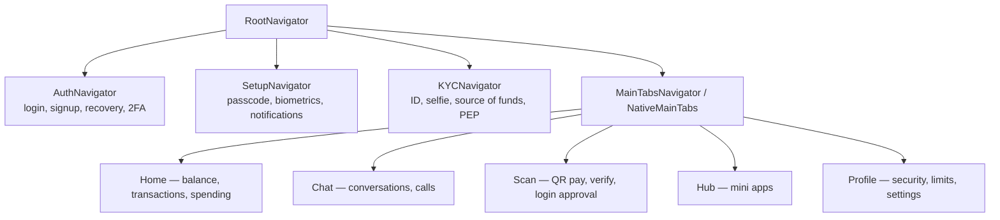
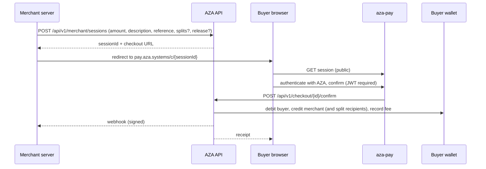

# 6. Security and Cryptography

## 6.1 Threat model

State the threat model explicitly; the controls in this chapter are then answers to it.

| # | Adversary | Capability assumed | Primary controls |
|---|---|---|---|
| T1 | Remote attacker with stolen credentials | Has a password | Multi-factor (TOTP/SMS/email/app-push/passkey), device recognition, new-device login challenge, behavioural detection, IP reputation |
| T2 | Attacker with a stolen unlocked phone | Physical device access | App lock + 4-digit passcode, biometric gate, passcode required per money movement, remote logout-everywhere, device blocking |
| T3 | Network attacker (hostile Wi-Fi, ISP) | Reads/modifies traffic | TLS 1.2+ everywhere, HSTS with `includeSubDomains` and one-year max-age, **native root-CA certificate pinning** on both mobile platforms |
| T4a | Attacker with a **stolen database dump or backup** | Reads persisted data, no access to deployment config | Chat bodies and media keys AES-256-GCM-encrypted at rest under `CHAT_CONTENT_KEY`; TOTP secrets encrypted under `TOTP_ENCRYPTION_KEY`; BCrypt password and passcode hashes. The key material lives in configuration, so the dump alone yields nothing. |
| T4b | Malicious or compromised **server operator** | Full database *and* deployment configuration | **Chat content: not defended, by design since 2026-09-02** (§6.3.0). Defended for pre-`a573783d` history, which remains per-device E2EE ciphertext, and for encrypted backups, whose recovery key is user-held. This row is the honest cost of cross-device history and must not be softened. |
| T5 | Malicious insider (staff) | Valid admin credentials | Role separation, maker–checker dual control, step-up 2FA, admin IP allowlist, hash-chained tamper-evident audit log |
| T6 | Malicious third-party integrator | Valid API key or OAuth client | Scoped restricted keys, tenant-scoped idempotency, ownership checks on every resource, test-mode keys that move no money, rate limiting, webhook signing |
| T7 | Malicious mini-app developer | Code running in the user's WebView | Declared permission manifest, per-user consent records, review before listing, disable/kill switch, CSP and origin isolation, no direct wallet access |
| T8 | Fraudster / money launderer | Legitimate account | Tiered KYC limits, velocity and structuring rules, anomaly scoring with `HELD_FOR_REVIEW`, sanctions screening, regulatory filing |
| T9 | Automated abuse (bots, credential stuffing, scraping) | Volume | Redis token-bucket rate limits (per-IP and per-user), hCaptcha challenge with HMAC-bound tokens, request fingerprinting |

## 6.2 Authentication and session management

### Primary authentication
- Password hashed with BCrypt (`PasswordEncoderConfig`).
- JWT access token, **15-minute** lifetime; refresh token, **30 days**, persisted as
  `RefreshToken` so it can be revoked server-side (a pure stateless JWT cannot be).
- Session policy is `STATELESS`; CSRF is disabled because no cookie-borne credential is
  used for the API — say this explicitly rather than letting `csrf().disable()` look like
  an oversight.

### Second factor — five methods
`User.TwoFactorMethod = { TOTP, SMS, EMAIL, APP, PASSKEY }`

- **TOTP** — RFC 6238. The shared secret is **encrypted at rest with AES-256-GCM**
  (`TotpEncryptionService`, key from `TOTP_ENCRYPTION_KEY`), not stored in plaintext.
  This is a genuinely good detail: a database dump alone does not yield working
  second factors.
- **SMS** via Arkesel; **email** via the Brevo HTTP API (chosen because DigitalOcean blocks
  outbound SMTP ports 25/465/587 — a real deployment constraint worth documenting).
- **APP** — push-approval to an already-authenticated device. The endpoint
  `POST /api/v1/auth/2fa/app/respond` is one of the few `/auth/**` paths that is explicitly
  `authenticated()`, because the responding device already holds a JWT. The ordering of
  that rule *before* the `/api/v1/auth/**` `permitAll` wildcard is load-bearing.
- **PASSKEY** — WebAuthn-style, `passkeysEnabled`.

### Account recovery — three independent paths
1. **Recovery codes** (`RecoveryCode`, `ManageRecoveryCodesScreen`).
2. **Recovery contacts** (`AccountRecoveryContact`) — a social-recovery scheme where
   nominated contacts vouch for the user. All recovery-contact endpoints require full
   authentication (they are not pre-auth flows), enumerated individually in
   `SecurityConfig` ahead of the auth wildcard.
3. **Standard OTP reset** over the registered phone or email.

### Transaction authorisation
Authentication proves who you are; a money movement additionally requires the
**4-digit passcode** (`User.passcodeHash`, BCrypt-hashed), optionally gated behind
biometrics (`expo-local-authentication`). This separation — session credential vs
transaction credential — is invariant #6 and should be drawn as a figure.

**Throttling (verified, `UserService.java:638`):** 5 failed attempts per rolling 5-minute
window, counted per user in Redis with a 5-minute TTL, cleared on success. Passcode *reset*
is separately limited to 3 attempts per 10 minutes and requires an emailed OTP
(`AuthService.java:535`).

State the resulting security margin precisely, because it is a fair examiner's question. A
4-digit passcode has 10⁴ = 10,000 possibilities. At 5 attempts per 5 minutes — 60 per hour —
an online exhaustive search averages **~83 hours** and worst-cases at **~167 hours**: long
enough to be impractical and to be noticed. But note what kind of argument that is: it is a
*throttling* argument, not an entropy one. Note too that the counter has no escalating
backoff and no permanent lockout, so the attacker's rate never degrades. The passcode's real
justification is that it is a second factor on an already-authenticated session on an
already-unlocked device, not a standalone credential.

**A control that existed only on the client, and now does not (`6c724810`).** The rules that
make a 4-digit passcode worth 10⁴ rather than considerably less — no `0000`, no repeated
digit, no straight run — lived solely in `CreatePasscodeScreen`. A modified client or a
direct API call could therefore set `0000` on an account that authorises money movement,
which reduces the margin computed above from ~83 hours to one attempt. `PasscodePolicy`
mirrors the rules server-side and runs at every write path: `setPasscode` covers set,
change and reset, and signup encodes its own. It validates **on write only**, so users
already holding a weak passcode keep working and are caught at their next change — the
standard, and correct, migration posture for a strengthened credential rule, since the
alternative locks existing users out of their own money to fix a problem they did not
create.

This is a good worked example of a general claim the thesis can make about client/server
trust boundaries: a validation rule that lives only in the UI is not a security control at
all, it is a usability affordance, and the two are easy to confuse precisely because they
are written in the same file.

### Device and session management
`DeviceService`, `DeviceBlock`, `device_last_used_location` (V7), logout-everywhere,
per-device E2EE identities, and `NewDeviceLoginScreen` for the unrecognised-device
challenge.

## 6.3 Message confidentiality

This is the most technically substantial part of the system and deserves its own thesis
section with a protocol diagram. It is also the part of the system whose *design changed
under evaluation*, which makes it the most interesting thing in the thesis rather than the
most embarrassing — provided the change is reported as what it was: a deliberate trade,
made for a reason, with the cost named.

### 6.3.0 The change that has to be stated first

**Between 2026-08-21 and 2026-09-02 user-to-user chat stopped being end-to-end encrypted
for new messages.** Any sentence in this chapter that reads "the server holds ciphertext
only" was true of the system audited in August and is not true of the system as it stands.

The forcing problem was cross-device history. Under the E2EE design, a message was
encrypted once per recipient *device*, using key material held in that device's
`expo-secure-store`. A device that logs in fresh — a replacement phone, a second phone, a
reinstall — holds no key material at all, so there is no envelope on the server it can
open. History therefore belonged to a *device*, not to an *account*. The mitigations built
for this (`ChatBackup`, `HistoryTransfer`) both require the *old* device to be present and
cooperative, which is precisely the case a lost or broken phone rules out.

The resolution taken was the one Telegram takes for cloud chats and Instagram takes for
DMs: make the server able to read message bodies, so it can serve history to any device
that authenticates as the account. Concretely (`a573783d`, `68894e13`, `c87c804c`):

| | Before (protocol v3) | After |
|---|---|---|
| Body on the wire | AES-256-GCM envelope, one per recipient device | Plaintext inside TLS |
| Body at rest | Per-device ciphertext rows, server cannot read | Single `content` column, AES-256-GCM under a **server-held** key |
| Who can read it | Only the participants' enrolled devices | The participants' devices **and the server operator** |
| New device gets history | No | Yes |
| Round trips per cold send | 2 key-bundle fetches + fan-out | 0 |

Two secondary effects came with it, and both are worth reporting because neither was the
motivation. The two key-bundle round trips that the per-device fan-out needed on a cold
send disappeared from the send path, where they had been the slowest step; and
`encryptForAllDevices` lost its last caller, along with seven imports that TypeScript did
not flag because the project does not set `noUnusedLocals` — a small, citable illustration
that dead code in a TypeScript codebase is invisible unless you go looking.

**What is still encrypted, and against what.** Losing E2EE is not the same as losing
encryption, and the distinction is the whole of the residual security argument:

- **At rest**, `MessageContentCipher` seals every body before it reaches the `content`
  column: `AES-256-GCM`, 12-byte nonce, 128-bit tag, 32-byte key supplied as
  `app.chat.content-key` (`CHAT_CONTENT_KEY` in the environment), stored as
  `gcm1:base64(nonce ‖ ciphertext ‖ tag)`. A stolen database dump or a leaked backup is
  ciphertext. The key lives in configuration, not in the table, so the two have to be
  stolen separately.
- **In transit**, TLS, with certificate pinning on the mobile client (§6.5).
- **Not** against the server operator, or against anyone who obtains both the dump and the
  deployment configuration. That is the property that was traded away.

Three implementation details are worth citing because each encodes a decision:

1. **The `gcm1:` prefix is a version marker, and its absence is meaningful.** Rows written
   before this existed — support-chat plaintext, and the legacy `content` values — are
   passed through untouched. This is what makes the migration a no-op for existing data
   rather than a rewrite of the whole table.
2. **A missing key degrades loudly but keeps serving.** With no `content-key` configured
   the service logs a warning at construction and stores bodies unencrypted rather than
   refusing to boot, because a development stack holding no real messages should not need
   a secret. The inverse case — encrypted rows present, key gone — logs an error and
   returns `null`, so the client renders a missing message rather than a base64 blob.
3. **A body that cannot be decrypted does not take down the history page.** `decrypt`
   catches and returns `null` per row. One corrupt row costs one message, not the
   conversation.

**Operationally, this key is now a single point of failure for every conversation on the
platform**, which is a genuine new risk the thesis should state rather than bury: rotating
or losing `CHAT_CONTENT_KEY` makes all existing messages unreadable, and no user-held
material can recover them. The compose file carries that warning inline.

### 6.3.1 The E2EE protocol (protocol v3)

The protocol below governed every send up to the change above, **and still governs
decryption of that history**: every message sent before `a573783d` remains a per-device
envelope on the server, so the reading half of `aza/src/crypto/` is load-bearing and is
still exercised by the crypto test suite. Describe it in the past tense for sends and the
present tense for reads. It is also the design a Double Ratchet would extend if the
platform ever moves back to E2EE for a subset of conversations (§13), so it is not
archaeology.

### Primitives

| Purpose | Algorithm | Library |
|---|---|---|
| Key agreement | X25519 ECDH | `@noble/curves` |
| Pre-key signatures | Ed25519 | `@noble/curves` |
| Key derivation | HKDF-SHA256 | `@noble/hashes` |
| Authenticated encryption | AES-256-GCM (12-byte nonce, 16-byte tag) | `@noble/ciphers` |

The `@noble` family was chosen for being audited, dependency-free and constant-time in
pure JavaScript — no native module, so the same code runs identically on iOS, Android and
in tests. Justify this against the alternative (libsodium via a native binding): fewer
build-time platform risks, at some CPU cost.

### Key hierarchy and multi-device identity

Every key is namespaced by `(userId, deviceId)` in `expo-secure-store`, which is
hardware-backed where the platform allows (Android Keystore, iOS Keychain wrapped by the
Secure Enclave). **Private keys never leave `keystore.ts` unencrypted.**

| Key | Type | Lifetime | Published to server |
|---|---|---|---|
| Identity key IK | X25519 | Long-term, per device | Public half only |
| Identity signing key | Ed25519 | Long-term, per device | Public half only |
| Signed pre-key SPK | X25519, signed by Ed25519 IK | Rotated on a cadence; the previous SPK private is retained to decrypt in-flight messages | Public half + signature |
| One-time pre-keys OPK | X25519 | Single use — the private half is **deleted at decrypt time** once used to derive a session | Public halves, in batches |
| Root key | Derived | Per (self, peer) pair; cached in SecureStore | Never |
| Per-message key | Derived | One message | Never |
| Media file key | Random AES-256 | One file | Never (travels inside the message envelope) |
| Backup recovery key | Random 256-bit | User-held | Never |

The server side is `UserKeyBundle` + `KeyBundleService` + `KeyBundleController`: it stores
and serves public bundles and hands out one-time pre-keys, and that is all it can do.

### Protocol v3 — X3DH session establishment

```
DH1 = DH(IK_sender, SPK_recipient)
DH2 = DH(EK_sender, IK_recipient)
DH3 = DH(EK_sender, SPK_recipient)
DH4 = DH(EK_sender, OPK_recipient)        // present when an OPK is available

rootKey = HKDF-SHA256(DH1 ‖ DH2 ‖ DH3 ‖ DH4,
                      info = "aza.chat.v3.x3dh|<senderId>|<chatId>")
```

- **First message:**
  `key = HKDF(rootKey, salt = EK_pub[0..16], info = "aza.chat.v3.msg0|…")`
- **Subsequent messages:** a fresh ephemeral EK per send, with
  `mix = DH(EK_sender, IK_recipient)` and
  `perMsgKey = HKDF(rootKey ‖ mix, salt = EK_pub[0..16], info = "aza.chat.v3.msgN|…")`
- **AAD** binds `(proto, senderId, chatId, ephemeralPub)` as **canonical JSON with sorted
  keys**. The v1 format used a pipe-separated string; it was replaced precisely because a
  delimiter-based binding can be made to collide as fields are added. This is a small but
  genuinely citable design lesson.
- `rootKey` is cached per `(selfUserId, peerUserId)` so only the first send/receive pays
  the X3DH cost.

Wire format of the envelope:

```
ephemeralPublicKey : base64(EK_pub)
ciphertext         : base64( nonce(12) ‖ AES-256-GCM(plaintext) ‖ tag(16) )
```

### Backward compatibility

Three protocol versions coexist. v3 is used for all new sends; **v2** (per-message
ECDH(EK, IK_recipient), canonical-JSON AAD) and **v1** (same, pipe-string AAD) remain as
decrypt-only fallbacks so messages already in flight from older clients at upgrade time
still open. Present this as the realistic answer to protocol migration in a deployed
mobile app: you cannot flag-day a cryptographic format when clients update on their own
schedule.

### Security properties — state these precisely

Scope these to **messages sent under protocol v1–v3**, i.e. history predating
`a573783d`. For messages sent since, the confidentiality claim is the one in §6.3.0:
encryption at rest under a server-held key, not end-to-end.

**Achieved (for v1–v3 history):**
- Confidentiality and integrity against a fully compromised server (T4): for those
  messages the server holds ciphertext, public keys and metadata only. Note the
  consequence, which is the honest counterweight to the change in §6.3.0 — **that history
  is exactly the history a newly linked device cannot read**, which is the problem the
  change was made to solve.
- **Partial forward secrecy.** Sender-side ephemerals are zeroed after send. On the
  recipient side, compromise of `IK_priv` alone is no longer sufficient to decrypt past
  messages — the attacker also needs `SPK_priv` (for DH1 and DH3) and, for each session's
  first message, the `OPK_priv`, which is consumed and deleted at decrypt time. SPK
  rotation bounds the window in which any single compromise is useful.
- Per-device compromise isolation: each device has its own identity, so compromising one
  device does not yield another device's sessions.

**Not achieved — say so:**
- **No post-compromise security (no self-healing).** That requires a Double Ratchet.
  v3 was explicitly designed so a ratchet can layer on top without breaking wire
  compatibility, but it is not implemented. This is the single most important limitation
  to state honestly, and it is already documented in the code's header comment.
- **Metadata** (who talks to whom, when, and message sizes) is visible to the server. E2EE
  protects content, not the social graph — and since §6.3.0, content is visible too.
- **No end-to-end confidentiality for current traffic.** The property above is a property
  of *stored history*, not of the running system. Stating it without that qualification
  would be the single most misleading sentence the thesis could contain.

**Mitigated by user action — safety numbers.** Because key bundles are fetched from an
AZA-operated directory, a malicious server could in principle substitute a key bundle
(the classic active MITM against a key-directory model). The system provides the standard
defence: an out-of-band **safety number** (`e2ee.ts:safetyNumber`, surfaced in
`ChatInfoScreen`). Its construction is worth describing precisely, since it is a small
protocol in itself:

```
sorted   = lexicographic sort of (IK_pub_mine, IK_pub_theirs)   // order-independent
digest   = SHA-256(sorted[0] ‖ sorted[1])
number   = first 30 decimal digits read out of digest, grouped 5 × 6
```

Note what the safety number now does and does not buy. It still detects a substituted
*identity key*, which matters for reading legacy history and for any future ratcheted
mode. It no longer protects the content of new messages, because those are not encrypted
to an identity key at all. Presenting an unchanged safety-number UI over a
server-readable transport would be the worst of both worlds — a security signal that
signals nothing — and §13 records it as a UI debt to be resolved, not a solved problem.

Sorting the two public keys before hashing is what makes both parties compute the *same*
number without exchanging anything. The UI additionally warns the user to re-verify when
the peer's key has rotated. The residual weakness is behavioural, not cryptographic: the
protection only holds if users actually compare the number over a second channel — a
well-documented usability finding in the secure-messaging literature that you should cite
rather than paper over.

**Scope caveat, and how it aged.** At audit, `ChatMessage` carried both a `ciphertext`
field and a `content` field, the latter commented in the entity as *"plaintext, used only
when `chat.isSupport = true`"* — customer-support conversations were stored in the clear,
necessarily, because a human support agent has to read them. The E2EE claim therefore had
to be scoped to **user-to-user** chat or it was simply false.

That caveat is now the *general* case rather than the exception: `content` is the body
column for every chat, support or not, and the only difference support chats retain is
that they were never encrypted at rest either until `MessageContentCipher` began sealing
the column for everyone. Worth reporting as a small lesson in its own right — the field
that existed as a documented exception turned out to be the field the system converged on,
because the constraint that forced it (somebody other than the sender's device must be
able to read this) was never actually specific to support.

### Server-side storage — and why the fan-out was abandoned

`MessageCiphertext` is **one row per (message, device)** — each send stored an envelope for
every recipient device *and* every other sender device, excluding the sending device itself,
which already held the plaintext. Each row carries the `ciphertext`, the `ephemeralKey`,
the `preKeyId`, and — on the first message of a session only — the
`senderIdentityPublicKey` the recipient needs to run X3DH.

The cost of multi-device E2EE is visible right here and is worth quantifying: a message to a
peer with 3 devices, sent from one of the sender's own 2 devices, produced **4 independently
encrypted ciphertext rows**. Storage and bandwidth scaled with the product of the
participants' device counts — the standard price of per-device identities, and precisely why
a group-messaging extension would have needed sender keys rather than naive fan-out.

**This is the quantified case for the trade in §6.3.0**, and it is the strongest evidence
the chapter has that the change was engineering rather than expedience. Per-device fan-out
costs O(devices) storage, O(devices) bandwidth and two synchronous key-bundle fetches per
cold send — and after paying all of that, it still cannot serve history to device *n+1*,
because that device was not enrolled when the envelopes were sealed. The model does not
merely make cross-device history expensive; it makes it *impossible* without a second
mechanism, and both second mechanisms available (`ChatBackup`, `HistoryTransfer`) require
the old device to be alive and cooperating.

The reading path is retained on both sides. `ChatService` still accepts and stores a
`deviceCiphertexts` map when a client sends one, and still returns per-device envelopes on
history pages, because messages sent before the change are the only copies that exist. The
mobile client's `decryptFromSender` and session-root helpers stay for the same reason. Only
the *sending* half was removed. Present this as the general shape of a protocol
retirement in a deployed system: you delete the writer, you keep the reader, and you keep
it for as long as the data lives — which for chat history is indefinitely.

### Media encryption
`mediaCrypto.ts`. Every uploaded file (voice note, image, video, document) is sealed with a
**fresh random 256-bit key** before leaving the device:

```
blob = nonce(12) ‖ AES-256-GCM(file bytes, AAD = "aza.chat.media.v1")
```

The opaque blob goes to Cloudinary. The constant AAD binds the ciphertext to this purpose
so a blob cannot be replayed as some other AES-GCM payload.

**Where the per-file key travels changed with §6.3.0, and the threat model changed with
it.** The key used to ride inside the message's E2EE envelope, so neither AZA nor
Cloudinary held a decryptable file. It now rides in the same server-readable `content`
field as the caption, as a small versioned JSON document:

```
content = { "v": 2, "k": base64(fileKey), "c": caption }
```

so that every device on the account can open the media, not only the devices enrolled when
it was sent — the media half of exactly the problem §6.3.0 solves for text. The residual
property is worth stating precisely, because it is not nothing and it is not
end-to-end either: **the media host never holds a decryptable file**, since Cloudinary
receives the blob and AZA holds the key; and the key is itself encrypted at rest inside
`content`, so a database dump alone yields neither. AZA, holding both the content key and
the blob URL, can decrypt. Sends with no file key — legacy, or a client without the
crypto module — fall back to the plain caption.

### Encrypted backup
`backupCrypto.ts`. Backups are sealed with a **random** 256-bit recovery key — not one
derived from a PIN. This is the key design decision: a PIN-derived key leaves the
server-held blobs brute-forceable offline, whereas a random key leaves nothing to attack.
The key is displayed once as **13 groups of 4 characters** in Crockford base32 (32 symbols,
excluding I, L, O and U; lookalikes are mapped back at parse time, O→0 and I/L→1, so
hand-transcription survives). 32 random bytes encode to 52 characters at 5 bits each
(260 bits ≥ 256). The trade-off — lose the code, lose the backup — is the honest cost of
the property, and should be stated as such.

Server side: `ChatBackup` + `ChatBackupChunk`, chunked so a large history can be uploaded
and restored incrementally. Cross-device history transfer uses the parallel
`HistoryTransfer` + `HistoryTransferChunk` with `HistoryTransferCleanupScheduler`.

## 6.4 Application security controls

| Control | Implementation | Notes |
|---|---|---|
| HSTS | `SecurityConfig` — `includeSubDomains`, `max-age=31536000` | |
| CSP | `default-src 'self'; frame-ancestors 'none'` | API responses; the web apps set their own |
| Clickjacking | `frameOptions().deny()` | |
| MIME sniffing | `contentTypeOptions()` | |
| Referrer policy | `STRICT_ORIGIN_WHEN_CROSS_ORIGIN` | |
| CORS | Explicit origin allow-list from `ALLOWED_ORIGINS`; credentials allowed; a fixed header allow-list (`Authorization`, `X-Device-ID`, `X-Platform`, `X-Api-Key`, `X-Aza-Client`, …) | No wildcard origin anywhere |
| Rate limiting | `RateLimitFilter` + Redis, configurable live via `RateLimitConfig` and `AdminRateLimitController` | Runs after JWT so limits can be per-user. Measured defaults: **150 req/60s per IP**, **200 req/900s per IP on auth paths**, **300 req/60s per request fingerprint**, **500 req/60s per user**, burst threshold 40. Unauthenticated rules key on **device before IP** — see below |
| Passcode strength | `PasscodePolicy`, enforced at every server-side write path | Was client-only until `6c724810`; see §6.2 |
| Email hygiene | `EmailValidationService` (syntax, MX-shaped checks, an 85-domain disposable-provider list loaded at boot) + `V63` case-insensitive unique index on `users.email` | The uniqueness rule was previously held by convention — every write path lowercased — and `PUT /users/me` was the hole. Moving it into the database means a future write path cannot forget it |
| Unverified identity change | Profile updates can no longer change email or phone without going through the verified-change flow (`8a887034`) | A direct `PUT /users/me` was writing `request.getEmail()` through unchanged |
| Bot challenge | `ChallengeService` + hCaptcha, tokens bound by `CHALLENGE_HMAC_SECRET` | |
| Request fingerprinting | `RequestFingerprintService` | |
| IP reputation | `IpReputationService` | |
| Behavioural detection | `BehavioralDetectionService` | |
| Trusted proxy | `TRUSTED_PROXY_IPS` + `nginx/conf.d/cloudflare-real-ip.conf` | Client IP is restored from Cloudflare headers only for trusted ranges — otherwise every per-IP control is trivially spoofable |
| Body size limits | 25 MB multipart file, 30 MB request, 5 MB non-multipart POST | Multipart is raised for mini-app bundles; the endpoints that need tighter limits enforce their own |
| Decompression-bomb defence | `aza.miniapps.max-uncompressed-bytes` bounds the **uncompressed** size during extraction | The compressed cap says nothing about what a zip expands to — a good, specific control to cite |
| **Certificate pinning** | Native root-CA pinning on both platforms via the Expo config plugin `aza/plugins/withSslPinning.js` — see §6.5 | Covers Axios, `fetch` *and* the WebSocket, with no JavaScript involvement |
| Screenshot protection | `expo-screen-capture` in the mobile app | |
| Console stripping | `babel-plugin-transform-remove-console` in production builds | |
| Geographic blocking | `GeoLocationService`, `GeoBlockedScreen` | |
| Soft delete + scheduled erasure | `@SQLDelete`/`@SQLRestriction` on `User`, `DeletionSchedulerService`, `GdprErasureService` | |
| Location retention | `LocationRetentionScheduler` | Transaction location data is aged out |

### Rate limiting under CGNAT — a control that was wrong for the deployment region

Worth a short subsection, because it is the clearest example in the system of a control
that is textbook-correct in general and actively harmful in the market the platform was
built for.

Every unauthenticated limit was keyed on the client IP. Ghanaian mobile carriers front
hundreds of unrelated subscribers behind one public address (carrier-grade NAT), so those
buckets pooled strangers together. The sharpest edge was failed-login scoring: **ten
mistyped passwords spread across a carrier auto-blocked the entire address**, and every
subscriber behind it, none of whom had done anything. A security control had become a
denial-of-service against ordinary users, delivered by the platform to itself.

`8330092c` keys rules 4, 7, 8 and 11 and the post-response scoring on `X-Device-ID` when
the caller presents one, and keeps the strict per-IP limit for callers that present no
device identity — so the fallback is the stricter behaviour, not the looser one, and a
client that omits the header gains nothing. The identifier-availability endpoints used
during signup gained a per-device budget of their own, with 429 handling and a
stale-response guard on the three screens that call them.

The methodological point for the thesis is that a device identifier is *weaker* evidence
than an IP — it is client-supplied and trivially rotated — and the change was made anyway,
because the question a rate limiter answers is not "who is this?" but "are these requests
the same actor?", and under CGNAT the IP answers that question wrongly for the honest
majority. Defence in depth carries the residual risk: fingerprinting, hCaptcha and
behavioural detection all still key independently. Covered by
`RateLimitFilterActorKeyTest` (new).

## 6.5 Certificate pinning — a case study worth writing up

Implemented as an Expo config plugin (`aza/plugins/withSslPinning.js`) applied at the
**native** layer on both platforms — Android Network Security Config and iOS
`NSPinnedDomains` — so *all* traffic is covered (Axios, `fetch`, and the WebSocket) with no
JavaScript involvement.

This is one of the strongest short narratives in the codebase. Give it a full subsection.

**The first design failed twice in production.** It pinned the Let's Encrypt **leaf** key
plus one intermediate. Two things broke it:

1. Let's Encrypt renews the leaf — with a **new key** — roughly every 90 days.
2. The domain is proxied through Cloudflare, which serves its own edge certificate and
   rotates both the certificate and the issuing CA at will.

And the compounding factor: **a native pin cannot be fixed by an OTA update.** A mismatch
bricks the app for every installed user until they download a new binary. In a payments app,
that is an outage with no remote remedy.

**The current design (changed 2026-07) pins root CAs instead.** Six SPKI-SHA256 pins across
the two authorities Cloudflare issues from for this zone:

| Root | Authority |
|---|---|
| ISRG Root X1 (RSA), ISRG Root X2 (ECDSA) | Let's Encrypt |
| GTS Root R1, R2 (RSA), R3, R4 (ECDSA) | Google Trust Services |

Root keys are stable for a decade or more, while validation still rejects any certificate
that does not chain to one of those specific roots — closing the realistic MITM path, a
mis-issued certificate from some other public CA or a locally-installed interception root.

**Two supporting controls make it safe rather than merely clever, and both belong in the
write-up:**

- **A coupled operational control.** Cloudflare Universal SSL must be restricted to the same
  CAs (`PATCH /zones/{zone}/ssl/universal/settings {"certificate_authority":"lets_encrypt"}`),
  or an edge certificate from a third CA would appear and fail validation. The pin set and
  the CDN configuration are one system; changing either alone causes an outage.
- **An expiry safety valve.** The Android `<pin-set>` carries `expiration="2027-08-01"`.
  After that date pinning **degrades to standard CA validation instead of hard-failing** —
  a deliberate decision that a forgotten update can never again brick payments.

A verification script, `node aza/scripts/check-pins.js`, checks the live chain against the
pin set.

**State the trade-off honestly.** Root-CA pinning is materially weaker than leaf pinning: it
trusts every certificate those two CAs issue for this domain, so it does not defend against
an adversary who can compel or compromise Let's Encrypt or Google Trust Services. It defends
against the realistic threat while remaining operable through routine certificate rotation.
That is the right call for this system — and articulating *why* is what turns a checkbox
into a contribution. It is also a clean illustration of a general principle worth naming in
the thesis: **a security control that cannot survive normal operations will be disabled, so
availability is a security property, not a competing concern.**

## 6.6 Verifiable artefacts

A distinctive feature: AZA issues artefacts that a **third party can verify without an
account**, addressing the "trust is asserted, not demonstrated" problem from §1.1.

- **Statement verification** — `GeneratedStatement`, `StatementVerifyController`,
  public `GET /api/v1/public/statements/verify` and a rendered page. An employer or bank
  can confirm a downloaded PDF statement is genuine.
- **Payment proof** — `PaymentProofController`, `PaymentProofService`. A QR code carrying
  its own **HMAC signature** (`PAYMENT_PROOF_HMAC_SECRET`), verifiable at the public
  endpoint. Because the signature is in the QR, the verifying endpoint needs no auth and
  the proof cannot be forged without the server key.
- **Merchant verification** — `MerchantVerifyResultScreen`, public merchant profile by
  handle, so a customer can confirm a store QR belongs to a KYB-verified business.

## 6.7 Compliance and risk controls

**KYC / KYB.** `KycService` with document and selfie capture (`ScanIdScreen`,
`SelfieScanScreen`, `VerifyFaceIdScreen`), source-of-funds and PEP declaration flows,
tiered limits (§5.2), annual re-review (`kycReviewDueAt`, +1 year on each approval,
`AdminKycExpiryController`), and `requireSelfieVerification` as a re-challenge flag.
Merchant KYB is available both on the web and via a **token-authenticated mobile handoff**
(`MobileKybService`, public `/api/v1/public/kyb-mobile/*` endpoints) so a business owner can
photograph documents with their phone mid-application.

`kyc.auto-verify` defaults to `false` and is documented as a local/demo-only switch.

**Transaction monitoring.** `RiskEngineService.evaluateTransfer` runs after each completed
transfer and applies four checks:

1. `checkLargeTransfer` — value threshold.
2. `checkVelocity` — count/value in a rolling window.
3. `checkStructuring` — the smurfing heuristic: **three or more transfers in 24 hours,
   each in the 70–100% band of the large-transfer threshold**.
4. `evaluateAnomaly` — scoring written back to `Transaction.anomalyScore` and
   `anomalyRiskLevel`; a HIGH score at confirmation moves the transaction to
   `HELD_FOR_REVIEW`.

Every evaluation writes a `RiskDecisionLog`, so the compliance position is reconstructable
after the fact. Thresholds live in `RiskRuleService` so COMPLIANCE can tune them live
without a deploy.

**The design rule to highlight: risk evaluation must never fail a transfer.** The whole
method body is wrapped in a try/catch that logs and continues. Discuss the trade-off — a
monitoring bug must not become a payments outage — and its cost: a silent evaluation
failure leaves a transaction unscored, which is why the decision log exists.

> **The cost was paid, and it is worth writing up in full (`V64`, September 2026).** The
> rule above assumes the failure it swallows is *contained*. It is not, when the failure is
> a database error, because a rejected statement poisons the whole JDBC transaction.
>
> On databases adopted from the legacy `ddl-auto=update` era, Hibernate had generated a
> `CHECK` constraint on `transactions.status` enumerating the statuses that existed at the
> time. `HELD_FOR_REVIEW` was added later, for this very hold. So on those databases the
> `UPDATE` that holds a suspicious transfer was rejected outright — and because the flush
> landed inside the risk engine's catch block, the exception was logged and swallowed
> exactly as designed. The transaction was already aborted, so the failure surfaced two
> statements later, on an unrelated `notifications` INSERT, as *"current transaction is
> aborted"*. **The user saw a raw Postgres error on the PIN screen, and the transfer was
> neither sent nor held.**
>
> Three things make this worth a paragraph rather than a footnote. First, the control that
> failed was the fraud hold — the failure mode was "high-risk transfers are not held", which
> is the one outcome the control exists to prevent. Second, the defensive `try/catch` did not
> merely fail to help; it *converted a clear error into a misleading one three call frames
> away*, which is a general and citable hazard of catch-and-continue around a transactional
> resource. Third, the root cause was schema drift from a superseded migration strategy —
> the same dynamic already recorded in `V31`, `V34` and `V38` — which is the strongest
> argument the thesis has for §10's insistence that the schema be Flyway's alone.
>
> The remedy drops the stale constraint, matching on `conkey` rather than on the constraint
> text so that only single-column CHECKs on `status` are touched; `transactions` also carries
> `type` and `recipient_type` constraints that a text match would have swept up. The value
> set is enforced by the Java enum, so the database CHECK was adding no safety to lose.

**Screening and reporting.** `ScreeningService` against `SanctionsListEntry` producing
`ScreeningMatch` — now paginated, because loading the whole sanctions list into memory to
screen one name scales with the list rather than the query (`e8d1066a`); `RegulatoryService` + `RegulatoryFiling`; `ComplianceService`;
`ReconciliationService` producing `ReconBreak`; `SafeguardingSnapshot` for the
issued-vs-safeguarded position; `AccountingExportService` for finance.

**Consumer protection.** `Dispute` + `DisputeService`, `Complaint`, `HandleReport`
(reporting impersonating handles), `MiniAppReport`, `AdminSlaController` for response-time
tracking, `AccountClosureRequest`, `DataRequest` for subject access.


---

# 7. The Mobile Application

The consumer client is the primary artefact: 102,410 lines of TypeScript across 406 files
and **171 feature screens** under `features/` (plus an animated splash screen in
`components/ui/`), built with React Native 0.86 and Expo SDK 57. It builds to a single
target on each platform, with no app extensions.

## 7.1 Architecture

```
aza/src/
├── features/      Feature-sliced screens — 16 domains (see §7.2)
├── navigation/    Root → Auth | Setup | KYC | MainTabs navigator hierarchy
├── providers/     13 React context providers (§7.3)
├── store/         32 Zustand stores (§7.4), account-scoped (§7.4a)
├── hooks/         14 shared hooks (useWallet, useChat, useTransactions, …)
├── services/      api.ts (axios instance), webrtcService, callAudioService, historySync
├── native/        Optional-native-module wrappers (§7.5) — webrtc, incallManager, viewShot
├── crypto/        Keystore, media crypto, backup crypto, codecs, CSPRNG, and the
│                  E2EE decrypt path retained for pre-2026-09-02 history (§6.3)
├── components/    Shared UI + chat components + miniapp host
├── theme/         Design tokens (dark default, lime #B7EE7A accent)
├── lib/, utils/   Validation, formatting, error mapping, category inference
└── types/         Shared TypeScript contracts
```

The organising principle is **feature-sliced architecture**: each feature owns its screens
and its local state, and shares only through `store/`, `hooks/`, `components/` and
`services/`. Justify it against the alternative (layer-first: all screens in `screens/`,
all state in `state/`) — at 171 screens, a layer-first tree makes every feature a
cross-directory scavenger hunt, and it makes ownership and deletion much harder.

### Navigation hierarchy



`NativeMainTabs` uses `react-native-bottom-tabs` to render **platform-native** tab bars
(UITabBar on iOS, BottomNavigationView on Android) rather than a JS-drawn bar. Worth a
sentence in the thesis: it is the difference between an app that looks cross-platform and
one that feels native, and it is the reason for the tab-spacing fix commits in the history.

## 7.2 Feature domains and screen counts

| Feature | Screens | What it covers |
|---|---|---|
| `auth` | 34 | Login (phone/email), 12-step signup, password reset, TOTP/recovery-code/contact-recovery/app-approval login, deactivated-account, geo-block, new-device |
| `chat` | 16 | Conversations, media preview, camera, audio + video call, incoming call, chat info, themes, backup, storage management, shared/starred/saved messages, broadcast, message info |
| `profile` | 33 | Personal details, appearance, notification settings, limits and usage, limit-increase request, wallet freeze, and the full security-and-privacy tree (2FA setup/disable for each method, passkeys, devices, recovery codes and contacts, connected apps, payment mandates, bill forwarding, delete account, logout everywhere, find-me-by) |
| `transfer` | 15 | Send flow (contact → amount → confirm → PIN → success), bulk transfer, request money, recurring transfers, spending, budgets, financial dashboard, AI assistant |
| `kyc` | 14 | ID type, ID front/back scan, selfie and face verification, source of funds, success/rejected, and the five-screen PEP flow |
| `scan` | 10 | QR scan, my code, merchant checkout, OAuth payment approval, QR-login approval, payment proof, and three public-verification result screens |
| `home` | 6 | Home, transactions, spending categories, statement download, withdraw, reversal request |
| `hub` | 11 | Hub, mini-app player, mandate approval, and the 8-screen in-app merchant KYB onboarding |
| `customercare` | 6 | Help and support, help topics, chat with us, chatbot, email us, talk to us |
| `security` | 4 | App lock, create/verify/reset passcode |
| `splits` | 4 | Splits list, create split, split detail, recurring splits |
| `contacts` | 4 | Contacts, profile, add friends, pending requests |
| `bills` | 3 | Bills, pay bill, receipt |
| `akyede` | 3 | Create gift, my gifts, open gift |
| `onboarding` | 5 | Intro, creating account, account ready, enable biometrics, fees and limits |
| `notifications` | 2 | Inbox, enable notifications |

## 7.3 Cross-cutting providers

Thirteen context providers compose the app shell. The interesting property is that they
are ordered: E2EE cannot initialise before auth resolves a `userId` and `deviceId`, and
the sockets cannot connect before E2EE has a keystore. `AuthProvider` additionally gates
account-scoped storage (§7.4a), which needs a resolved account before it may read or
write anything.

| Provider | Responsibility |
|---|---|
| `AuthProvider` | Token lifecycle, refresh rotation, `authEvents` bus for forced logout |
| `SecurityProvider` | App-lock state, passcode gate, biometric prompt |
| `E2EEProvider` | Identity/pre-key generation, publication, rotation, safety numbers |
| `ChatSocketProvider` / `CallSocketProvider` | STOMP connections with reconnect/backoff |
| `PresenceProvider` | Online status heartbeat |
| `NotificationProvider` | FCM registration, Notifee display, deep-link routing |
| `NetworkProvider` | Connectivity via NetInfo; offline banners and queueing |
| `KYCProvider`, `ProfileProvider`, `SignUpProvider` | Multi-step flow state that must survive screen changes |
| `DisplayProvider`, `ToastProvider` | Theme/appearance and transient feedback. `DisplayProvider` also owns `balanceHiddenByDefault`, rendered as `••••` by `HomeScreen` |

## 7.4 State management

**Zustand** for client state (32 stores) and **TanStack Query** for server cache. The split
is the standard one and easy to defend: Query owns anything the server is the source of
truth for (balance, transactions, contacts) with caching, retry and invalidation for free;
Zustand owns anything the client is the source of truth for (drafts, pins, reactions, read
receipts, chat lock, backup keys).

Notable stores:

| Store | Why it exists |
|---|---|
| `encryptedMessageStore` | Ciphertext-at-rest for the local message database |
| `sessionCache`, `sessionRootCache`, `peerIdentityCache` | X3DH root-key and peer-identity caching so only the first message per peer pays the handshake cost |
| `backupKeyStore` | Custody of the user-held recovery key |
| `chatLockStore` | Per-conversation lock |
| `scheduledMessagesStore`, `draftStore`, `pinnedMessageStore`, `reactionStore`, `readReceiptsStore`, `pollStore`, `starredMessagesStore`, `savedMessagesStore` | Messenger-grade chat features |
| `transferStore` | The multi-screen send flow's in-progress state |
| `settledRequestsStore` | Prevents a settled money request being acted on twice from a stale screen |
| `accountSession`, `persistence`, `eventCursor`, `legacyStorageCleanup` | Account scoping and the durable event cursor (§7.4a) |

### 7.4a Account-scoped persistence — a multi-user bug class removed

`bbc22eb5` migrated every persisted store from a global storage key to one namespaced by
account. The defect class this closes is worth naming, because it is specific to
phone-first markets and easy to miss on a developer's single-account device: **a shared
phone, or a user with a personal and a business account, would see the previous account's
drafts, pinned chats, themes, read receipts and starred messages after switching.** Some of
those are cosmetic; a draft message addressed to the wrong person is not.

Three parts, and the third is the one usually forgotten:

1. `persistence.ts` centralises key derivation, so a store cannot accidentally persist
   globally — the same chokepoint argument as `WalletLedger` (§5.4a), applied to storage.
2. `accountSession.ts` owns the current account identity and the switch, so a store never
   reads a key for an account that is halfway through changing.
3. `legacyStorageCleanup.ts` removes the pre-migration global keys. Without it the old data
   sits in storage indefinitely — invisible, still readable by anything that constructs the
   old key, and a data-retention question at deletion time.

`eventCursor.ts` is the client half of `WebSocketEventLog` (§4.5): it records the last
Redis-Stream entry id the device has seen, per account, so a reconnect replays from that
point rather than refetching a conversation. It is account-scoped for the same reason —
replaying one account's cursor against another's stream is meaningless.

Covered by `accountSession.test.ts` and `sessionRootCache.test.ts`.

## 7.5 Notable client-side engineering

- **Offline resilience.** NetInfo-driven connectivity state, TanStack Query cache as the
  offline read path, and queued sends.
- **OTA updates.** `expo-updates` — critical for a fintech where a client-side bug must be
  fixable without a store review cycle. Discuss the constraint: OTA can only ship JS, so
  native-module changes still need a store submission.
- **Media pipeline.** `expo-image-picker`/`camera` → `expo-image-manipulator`
  (resize/compress) → `mediaCrypto.encryptMedia` → upload → `useDecryptedMediaUri` for
  transparent decryption at render time. The per-file key now travels in the message's
  server-readable body rather than an E2EE envelope (§6.3), so any device on the account
  can open the media.
- **WebRTC calling.** `react-native-webrtc` + `react-native-incall-manager` for audio
  routing and proximity, signalling over the app's existing STOMP socket, TURN credentials
  minted server-side with an HMAC and a TTL, relayed by coturn (§4.5).
- **Optional native modules (`src/native/`).** WebRTC, in-call management and view-shot are
  each wrapped so the app degrades to a stub in Expo Go rather than crashing at import. This
  exists because the SDK 57 bump stubbed the WebRTC media layer out entirely for Expo Go and
  it stayed stubbed in development builds too (`04948424`) — the wrapper makes the
  Expo-Go/dev-client distinction explicit at one boundary instead of implicit at twenty call
  sites. `expoGo.ts` is the single predicate.
- **Screen-capture prevention** on sensitive screens via `usePreventScreenCapture`.
- **Store compliance.** The repo carries `docs/STORE_DATA_DISCLOSURES.md`,
  `docs/STORE_REVIEW_NOTES.md`, `docs/IPAD_OPTIMIZATION.md` and an
  `app-store-audit` review skill — evidence of a real submission process, not a prototype.

### Sockets that lie about being connected — three variants of one bug

The most instructive cluster of client-side defects in the project's history, because the
same root cause produced three different user-visible symptoms in three different
subsystems, and none of them is reachable by a unit test.

**The root cause.** `stompjs` sets `connected` from the CONNECTED frame and clears it on a
close event. A socket the OS kills while the app is suspended — or that the network drops
silently — never produces that close event. `connected` therefore stays `true` on a dead
socket, and every `if (client.connected)` guard in the codebase silently does the wrong
thing. The library is not at fault; a userspace library cannot observe a connection the
kernel has already discarded.

| Subsystem | Symptom | Fix |
|---|---|---|
| **Calls** (`24ee0908`) | Incoming calls were delivered to a socket that only looked alive, so the phone never rang | Heartbeat ack with a 4-second tolerance — tight, because the user is watching |
| **Chat** (`69efc79a`) | Messages stopped arriving while the UI looked perfectly healthy: the foreground handler's `if (!client.connected)` guard skipped the reconnect, and since resync only rode on `onConnect`, nothing asked the server what was missed either | Resync on **every** foreground rather than only after a reconnect, plus resync on screen focus |
| **Presence** (`9f352902`) | Users showed offline to their chat partners while sitting in the app with it open | Subscribe to the heartbeat ack the server had always sent; 10-second silence rebuilds the socket |

Three details are worth drawing out for the thesis:

1. **The presence failure was unrecoverable, not merely transient.** `PresenceProvider` is
   the only thing in the system that refreshes the server's presence TTL — the chat and call
   sockets never touch it. Every 30-second heartbeat went nowhere silently, the Redis key
   lapsed after 65s, the sweeper flipped the user OFFLINE and fanned that out, and *nothing
   could recover it*, because the only thing that could mark them online again was the
   heartbeat dropping into the void. A liveness mechanism whose own failure is invisible to
   it has no floor.
2. **The server had always acked, and the call socket was already using that ack.** The
   mechanism needed to detect the zombie existed and was in use one directory away. This is
   the client-side twin of the §12.8 observation about `AgentCashService` and `ChatService`:
   the correct pattern was already in the codebase, and the gap was that nothing forced its
   adoption.
3. **The tolerances differ deliberately** — 4 seconds for calls, 10 for presence — because
   one fires on something the user is actively watching and the other on a timer. Reporting
   the reasoning rather than just the constants is what makes it an engineering decision
   rather than a magic number.

The chat resync is also a small, citable efficiency argument: asking for a resync on every
foreground sounds wasteful, but it is one frame answered from the client's cursor in the
durable event log (§4.5), so the ordinary "nothing missed" case costs an empty reply rather
than a history fetch.

## 7.6 Design system

From `PRODUCT.md`, which is a genuine design specification and should be quoted in the
thesis rather than paraphrased:

- **Target user:** 18–35 in Ghana and across Africa, phone-first, transacting daily.
- **Positioning by negation** — explicit anti-references: not Wave/Chipper's navy-and-gold
  "African fintech template", not Cash App's personality-free black-and-green, not generic
  SaaS scaffolding, not Web3 purple gradients. Designing against named alternatives is a
  defensible design method; cite it as such.
- **Palette:** dark as the default voice; lime `#B7EE7A` as the single expressive accent,
  used surgically.
- **Accessibility floor:** WCAG AA. `prefers-reduced-motion` respected throughout with an
  instant-reveal fallback for every animation. Lime on dark green `#174717` passes 4.5:1
  for body text. All interactive elements carry a visible focus ring.

The same tokens are the default mini-app theme (`miniapps/types.ts`), so an embedded app
inherits the host's look unless it opts out.


---

# 8. The Web Surfaces

Five Next.js 16 / React 19 applications, all built with Tailwind 4 and (except `aza-pay`)
a shadcn-style component layer over Base UI.

## 8.1 `aza-web` — marketing, legal and developer portal

`aza.systems` · 15,922 LOC

| Area | Route | Purpose |
|---|---|---|
| Marketing | `/`, `/about`, `/agents`, `/security`, `/mini-apps`, `/blog/[slug]` | Positioning per `PRODUCT.md`; GSAP + Lenis for motion |
| Legal | `/terms-of-service`, `/privacy-policy`, `/cookie-policy`, `/compliance` | |
| Developer portal | `/developers`, `/developers/{signup,login,forgot-password,apps,guides,changelog,status}` | Self-service app registration, docs, changelog, status |
| **API explorer** | `/developers/api-explorer` | A curated explorer built on the public OpenAPI JSON — see below |
| OAuth | `/oauth/authorize`, `/oauth/consent` | The consent screen for "Sign in with AZA" |
| Public payment page | `/pay/[handle]` | Pay any AZA user or merchant by handle without an account page |
| Public verification | `/verify` | Statement and payment-proof verification |
| Merchant public profile | `/m/[handle]` | |
| Waitlist | `/api/waitlist` | Server route → backend |

**The API explorer is an architectural decision worth a paragraph.** The backend publishes
OpenAPI JSON at `/v3/api-docs` (public), but `springdoc.paths-to-match` restricts it to
`/api/v1/merchant/**`, `/api/v1/checkout/**`, `/api/v1/developer/**` and `/oauth/**` —
internal mobile and admin endpoints are deliberately excluded from the published contract.
The raw Swagger UI, with its ungated try-it-out against the live host, is **off by default**
(`SWAGGER_UI_ENABLED=false`) and is dev-only; the public explorer wraps the same spec with
test-mode guards. The lesson: the documented API surface is a product decision, not an
artefact of the framework.

## 8.2 `aza-admin` — back office

`admin.aza.systems` · 26,654 LOC · the largest web surface, 40+ operational areas.

| Group | Areas |
|---|---|
| Customer operations | `dashboard`, `users`, `cs`, `complaints`, `disputes`, `support`, `closure-requests`, `data-requests`, `devices` |
| Compliance | `kyc`, `kyc-analytics`, `kyb-review`, `compliance`, `screening`, `risk`, `fraud-detection`, `filings`, `reports` |
| Money operations | `payouts`, `float`, `fund-transfers`, `reconciliation`, `fees`, `recurring-transfers`, `limit-requests`, `wallet`, `settlements` |
| Network | `agents`, `merchants`, `referrals`, `waitlist`, `segments`, `campaigns` |
| Platform | `miniapps`, `oauth-apps`, `webhooks`, `rate-limits`, `settings`, `maintenance`, `templates`, `staff` |
| Oversight | `approvals` (maker–checker queue), `audit-log`, `monitor`, `health`, `analytics`, `bulk-ops` |

Uses TanStack Query for data and **STOMP over SockJS** for live operational feeds (the
monitoring and alert views), plus `react-simple-maps` + `world-atlas` for geographic
distribution of activity. Everything behind `AdminStepUpFilter` (fresh 2FA) and, optionally,
`AdminIpAllowlistFilter`.

## 8.3 `aza-merchants` — merchant portal

`merchants.aza.systems` · 15,512 LOC

Self-service for businesses: `dashboard`, `transactions`, `customers`, `analytics`,
`products`, `invoices`, `payment-links`, `discount-codes`, `plans`, `subscriptions`,
`payouts`, `settlements`, `holds`, `mandates`, `bulk-transfers`, `send`, `connect`,
`api-keys`, `webhooks`, `embed`, `store-qr`, `oauth-apps`, `mini-apps` (submission),
`team`, `audit-logs`, `notification-preferences`, `disputes`, `settings`, plus
`signup`/`onboarding` with KYB and a `/m/[token]` mobile-KYB handoff.

Two things to highlight:
- **`store-qr`** generates the QR a physical shop displays. It can carry a `terminalId`, so
  a merchant can label tills, branches or cashiers — the field is free-form and AZA never
  interprets it (`Transaction.terminalId`).
- **`embed`** produces a drop-in payment widget, the lowest-effort integration tier below
  the hosted checkout.

## 8.4 `aza-pay` — hosted payment surfaces

`pay.aza.systems` · 2,014 LOC — deliberately the smallest app.

- `/c/[sessionId]` — hosted checkout. The buyer authenticates with AZA and pays from their
  wallet; the merchant never handles credentials.
- `/m/[mandateId]` — payment-mandate approval, where a payer reviews the merchant name,
  ceilings and cadence before authorising recurring charges. The GET for public mandate
  terms is unauthenticated so the page renders before login; approval requires a JWT.

Keeping this surface small and dependency-light is a security decision: it is the only web
app that routinely handles an authenticated payment action from an untrusted referrer, so
its attack surface is minimised by construction.

## 8.5 `aza-superagents` — the master-agent console

`superagents.aza.systems` · 3,145 LOC · port 3003. Built in `d35b9b59`; at the August audit
this was an empty scaffold, and the earlier draft of this chapter listed only four apps.

| Area | Route | Purpose |
|---|---|---|
| Dashboard | `/dashboard` | Downline float position at a glance |
| Agents | `/agents`, `/agents/[id]` | The master's own sub-agents and their float |
| Invite | `/agents/invite` | Files a PENDING agent application with the parent set — staff maker–checker still activates it, so a master cannot put its own recruit live |
| Distribute | `/distribute` | Push float down to a sub-agent, or recall idle float back up before a settlement run |
| Distributions | `/distributions` | The `float_distributions` ledger, filtered to this master |
| Reconciliation | `/reconciliation` | Master-level position against the sub-agent tills |

### Two security decisions worth defending

Both are places where the console deliberately does *not* copy the pattern from a sibling
app, which is the more interesting kind of decision to write up.

1. **No token reaches the browser at all.** Access and refresh are both `httpOnly` cookies,
   and every backend call goes through a single proxy route, `/api/sa/[...path]`, whose
   backend prefix is **fixed in the handler** so a crafted path cannot relay the session's
   credentials to an arbitrary endpoint. A console whose primary action is moving float is
   the wrong place for a token in `localStorage`.
2. **No 2FA bypass.** The merchant portal skips the second factor for non-staff merchants —
   a defensible trade for a self-service dashboard. This console rejects that trade, for the
   same reason as above: the actions differ, so the authentication requirement differs, even
   though the code was there to copy.

This app is also the practical test of the scaffolding checklist in §8.6: it was stood up
with security headers, CORS registration, the internal-secret proxy pattern, a port
assignment, nginx config, a compose service, a CI matrix entry and a GHCR image from the
first commit, rather than acquiring them afterwards.

## 8.6 Shared web hardening

Every app is built with a build-time `NEXT_PUBLIC_API_URL`, ships behind nginx with TLS,
and is subject to the backend's origin allow-list (`ALLOWED_ORIGINS`). New subdomain apps
are scaffolded from a checklist that applies security headers, CORS registration, the
internal-secret proxy pattern, port assignment, nginx config, compose service, CI matrix
entry and GHCR image from day one (`.claude/skills/new-subdomain-app/SKILL.md`) —
worth citing as evidence of a repeatable hardening process rather than per-app improvisation.
`aza-superagents` (§8.5) is the first app built entirely through that checklist, which makes
it the evidence that the checklist is executable rather than aspirational.


---

# 9. The Developer Platform

AZA is not only an app; it is a platform with four distinct third-party integration
surfaces. This chapter is a strong differentiator for the thesis — most student fintech
projects stop at the consumer app.

## 9.1 Merchant API (server-to-server)

**Authentication:** `X-Api-Key` header. Two key classes, and the distinction is
load-bearing:

| Prefix | Behaviour |
|---|---|
| `aza_live_…` | Moves real money |
| `aza_test_…` | **Sandbox — validates everything, moves no money.** |

Keys can be **restricted** with scopes (e.g. `transfers:read`, `transfers:write`); full
secret keys have access to everything. `MerchantApiKeyFilter` authenticates the key,
resolves the merchant principal, and skips entirely if a valid JWT already authenticated
the request — so the merchant portal and a server integration share the same controllers
without ambiguity about who is acting.

Supporting entities: `MerchantApiKey`, `MerchantApiLog` (per-call logging),
`MerchantAuditLog`, `WebhookEndpoint`, `WebhookDelivery`.

Published surface (`springdoc.paths-to-match`): `/api/v1/merchant/**`,
`/api/v1/checkout/**`, `/api/v1/developer/**`, `/oauth/**`. A Postman collection ships at
`docs/AZA_Backend.postman_collection.json`.

### Merchant pricing is now administered, not configured

Until `V62` a merchant's MDR was a single integer on the merchant row, changed by editing
that row. It is now resolved through the same versioned fee engine as consumer fees, and
two consequences matter at the API and operations layer rather than in the pricing model
itself (§5.2 covers the model):

- **Plan changes go through maker–checker.** Moving a merchant between pricing plans is a
  gated action like any other privileged money-affecting change, so a rate cannot be altered
  by one person. The approval workflow was extended to carry fee updates (`8498a47b`).
- **Historical pricing is now answerable.** `effective_from`/`effective_to` on plan rules
  means "what rate was this merchant on in March?" is a query rather than an archaeology
  exercise — which matters for dispute handling and for the settlement statements merchants
  reconcile against.

## 9.2 Hosted checkout



Notable properties:
- **GET on a session is public**; confirm and cancel require an authenticated JWT
  (`SecurityConfig`). This is what lets the page render before the buyer logs in.
- **Idempotency is scoped per merchant** (`V43`), not globally.
- **Test mode** propagates through the session (`V32__checkout_session_test_mode.sql`) so a
  sandbox session can traverse the entire flow without moving value.
- Discount codes validate at a **public** endpoint (`POST /api/v1/checkout/discount/validate`)
  because the buyer applies them pre-authentication.
- `CheckoutRefundSplitTest` covers the hard case: refunding a payment that was split.

## 9.3 AZA Connect — marketplace payments

Full guide: `docs/AZA_CONNECT.md`; partner kit at `docs/aza-connect-partner-kit/`.

The problem Connect solves: a marketplace wants buyers to pay from their AZA accounts and
sellers to receive into theirs, **without every seller becoming an AZA merchant**. The
platform integrates as a single merchant (one KYB, one wallet, one set of keys) and stays
the merchant of record; sellers are ordinary AZA users identified by email or username.

**Two settlement models:**

**A — Split at checkout** (automatic, at the moment of sale):
```
Buyer pays 100 GHS
  ├─ seller wallet   +85.00   (credited instantly)
  ├─ platform keeps  +13.50
  └─ AZA fee          +1.50   (1.5%)
```
The sum of splits must not exceed the amount **after** the AZA fee; the platform keeps the
remainder. Entity: `CheckoutSessionSplit`.

**B — Direct transfer** (collect first, pay sellers later):
```
Buyer pays 100 GHS → platform balance +98.50
  … later, on the platform's own schedule …
POST /connect/transfers { recipient, amount: 85 }
  → platform balance −85 → seller wallet +85
```
Entity: `ConnectTransfer`, with `UNIQUE (merchant_id, idempotency_key)`.

Split is best when the seller is known at checkout; transfers are best for payout runs,
adjustments and clawbacks. Scope is explicitly stated in the guide: **Ghana only, GHS only,
v1**.

Compare with Stripe Connect in the thesis: Stripe onboards sellers as sub-merchants
(Express/Custom accounts) with their own KYC; AZA v1 deliberately does not, trading
regulatory reach for integration simplicity — the seller needs nothing but an AZA account.
That trade-off, and its limits, is a good discussion point.

## 9.4 Sign in with AZA — OAuth 2.0

Full guide: `SIGN_IN_WITH_AZA.md`. Two flows.

### Standard Authorization Code + PKCE
For web and mobile clients. Endpoints: `/oauth/authorize`, `/oauth/approve`,
`/oauth/token`, `/oauth/userinfo`, `/oauth/revoke`. Consent screen at
`aza.systems/oauth/consent`. Entities: `OAuthClient`, `OAuthAccessToken`.

### QR login flow — the distinctive one
For desktop, smart TV and kiosk clients where the user cannot type a password:

```
Your server                    AZA backend            AZA mobile app
    │── POST /oauth/qr/initiate ───▶│                       │
    │◀── QR PNG + challengeToken ───│                       │
    │  [display QR]                 │◀─ user scans QR ──────│
    │                               │◀─ user taps Approve ──│
    │── GET  /oauth/qr/status ─────▶│                       │
    │◀── { status: "APPROVED" } ────│                       │
    │── POST /oauth/qr/complete ───▶│                       │
    │◀── access_token + refresh ────│                       │
```

Security properties to point out:
- The QR session lives **90 seconds**.
- `sessionSecret` is returned to the integrating **server** and must never reach the
  browser — it is what authorises the final `complete` call, so a hijacked QR alone is
  useless.
- `POST /api/v1/auth/qr-login/authorize` is one of the few `/auth/**` paths explicitly
  marked `authenticated()`: the approving mobile user must already be logged in.
- Client secrets are shown **once** and rotate via
  `POST /api/v1/developer/clients/{clientId}/rotate-secret`.

### Scopes
`identity` (name, username, avatar), `email`, and payment scopes for delegated charging.

### Delegated payment and mandates
Beyond identity, a third party can charge a user:
- **One-off:** `OAuthPaymentController` — the user approves in-app
  (`OAuthPaymentApprovalScreen`).
- **Recurring:** `PaymentMandate` + `MandateCharge` (`V48__payment_mandates.sql`). The user
  approves a mandate carrying the merchant name, **ceilings** and **cadence** on the
  hosted page `pay.aza.systems/m/{mandateId}` or in-app (`MandateApprovalScreen`), and can
  review and revoke it later (`PaymentMandatesScreen`). Execution is
  `MandateChargeExecutor`, audited by `MandateChargeAuditService`.

This is the platform's answer to card-on-file recurring billing without cards: a
user-authorised, bounded, revocable standing authority. Present it as such.

## 9.5 Mini Apps

Third-party applications embedded in the AZA client — the super-app surface.

### Runtime model
A mini app is a web bundle rendered in a WebView (`MiniAppPlayerScreen`). The native app
injects `window.aza`; the developer ships no runtime code. The published SDK
(`@az-spaces/aza-miniapp-sdk` / `@jumpspaces/aza-miniapp-sdk`) provides only TypeScript
types and helpers:

```ts
import { waitForAza } from '@jumpspaces/aza-miniapp-sdk';
const aza = await waitForAza();
const user = await aza.getUser();
```

### Permission and consent model

Permissions are declared at **submission** time and shown on a consent sheet the first time
the user opens the app.

| Permission | Grants |
|---|---|
| `USER_PROFILE` | username, first/last name, avatar — **implicit**, always included |
| `USER_PHONE` | phone number |
| `USER_EMAIL` | email address |
| `MAKE_PAYMENTS` | `aza.requestPayment()` |
| `READ_BALANCE` | `aza.getBalance()` |
| `READ_TRANSACTIONS` | transaction history (not yet available) |

Design properties worth citing:
- **Least privilege is enforced by review**, not just advised — apps requesting
  permissions without a clear purpose are rejected.
- **Deny is a first-class outcome.** SDK calls for denied permissions throw; the guide
  requires developers to handle it rather than assume consent.
- **Consent is revocable** from AZA profile settings; the record is `MiniAppConsent`.
- The mini app never touches the wallet directly — it *requests* a payment, and the
  native host renders AZA's own confirmation UI. The trust boundary is the bridge.

### Lifecycle and governance
`MiniApp` (registry, `V14`), `MiniAppStatus` (`V13`), `DisabledMiniApp` (`V11`, a kill
switch), `MiniAppReport` (user reporting), submission through the merchant portal,
review and approval through `aza-admin`, catalogue sync via `MiniAppCatalog`.

### Self-hosting bundles — an infrastructure contribution
Originally developers needed their own domain and HTTPS host. `V49__miniapp_bundle_hosting.sql`
plus `MiniAppBundleService` let AZA host the bundle itself:

1. The developer uploads a zipped web build (React, Vite, or an Expo/React Native **web
   export** — `docs/08-expo-and-react-native.md` covers this).
2. The backend extracts it into the shared `miniapp_bundles` volume, bounding the
   **uncompressed** size (`aza.miniapps.max-uncompressed-bytes`) as the real defence
   against a decompression bomb.
3. nginx serves it read-only from `/srv/miniapps`.
4. Each app is served from **its own origin, one DNS label deep**:
   `<app>-mini.aza.systems` live, `<app>-mini-preview.aza.systems` while in review. One
   origin per app is what stops any mini app reading another's `localStorage`, IndexedDB,
   cookies or service workers. Keeping it one label deep is what keeps it inside
   Cloudflare's free `*.aza.systems` certificate (see §4.6). `current` and `preview` are
   symlinks the service swaps atomically, so publishing and rolling back never rewrite a
   file nginx is reading.

Reference apps in `miniapps/`: `play-2048`, `snake`, `connect4`, `radio`, `notepad`,
`cedirates`, `salifu-and-master` — a mix of games, utilities and a Ghana-specific FX-rate
app, all built against the public SDK, which is itself the proof the SDK is usable.

## 9.6 Webhooks

`WebhookEndpoint` + `WebhookDelivery` + `WebhookService`, managed from the merchant portal
and observable in `aza-admin`. Verified implementation:

| Property | Implementation |
|---|---|
| **Signature** | HMAC-SHA256 over the raw payload with the endpoint's `signingSecret`, sent as `X-Aza-Signature: sha256=<hex>` |
| **Correlation headers** | `X-Aza-Event` (event type), `X-Aza-Delivery` (delivery UUID — lets the consumer deduplicate idempotently) |
| **Retry schedule** | 7 attempts at **5s → 30s → 5m → 30m → 2h → 6h → 24h**, then marked `ABANDONED` |
| **Success criterion** | HTTP 2xx; anything else schedules a retry |
| **Timeouts** | 10s connect, 15s request |
| **Persistence** | Every attempt recorded on `WebhookDelivery`: attempt count, last attempt, response status, first 500 bytes of the response body |
| **Subscription** | Opt-in per endpoint — an event is delivered only if the endpoint's `events` list names it or is `*` |
| **SSRF guard** | `validateWebhookUrl` requires HTTPS and rejects any URL resolving to a loopback, site-local, link-local or any-local address |

**The SSRF guard deserves a paragraph in the security chapter, not just this table.** A
webhook endpoint is a user-supplied URL that the *server* then fetches — the textbook
server-side request forgery primitive. Rejecting private address space stops a merchant
pointing an endpoint at `169.254.169.254` (cloud instance metadata) or at an internal
service reachable only from the application host.

Note the residual weakness for completeness: the guard resolves the hostname once, and the
HTTP client resolves it again when the request is made. A DNS-rebinding attacker controlling
the authoritative nameserver could return a public address for the first lookup and a
private one for the second. Closing it properly requires resolving once and connecting to
the validated IP directly (pinning the socket address), which is a known and citable
hardening step for future work.
