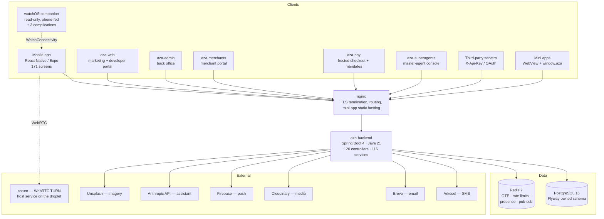
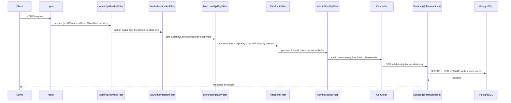
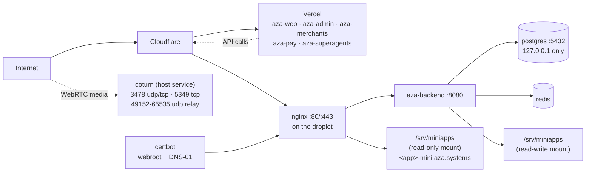

# 4. System Architecture

## 4.1 Overview

AZA is a **monorepo containing eight deployable artefacts** plus a shared mini-app SDK and
a watchOS companion embedded in the mobile app. All clients speak to one backend over
HTTPS/WSS; the backend owns the only database.

The watch is the one exception to that sentence and the exception is deliberate: **it never
authenticates and never calls the API**, receiving everything from the paired phone over
WatchConnectivity (§7.7). Draw it as a leaf off the mobile client, not as a ninth client.



## 4.2 Deployable components

| Deployable | Purpose | Public host | Port |
|---|---|---|---|
| `backend` | The entire API, WebSocket broker, schedulers | `api.aza.systems` | 8080 |
| `aza-web` | Marketing site, blog, legal pages, developer portal, API explorer, OAuth consent screen, public `/pay/[handle]` and `/verify` pages | `aza.systems`, `www.aza.systems` | 3000 |
| `aza-admin` | Back office: 40+ operational areas (KYC, disputes, float, risk, reconciliation, filings) | `admin.aza.systems` | 3001 |
| `aza-merchants` | Merchant self-service: API keys, products, invoices, payouts, settlements, webhooks, Connect, mandates, team, mini-app submission | `merchants.aza.systems` | 3001 |
| `aza-pay` | Hosted checkout `/c/[sessionId]` and mandate approval `/m/[mandateId]` | `pay.aza.systems` | 3002 |
| `aza-superagents` | Master-agent console: downline, float distribution and recall, reconciliation, sub-agent invitation | `superagents.aza.systems` | 3003 |
| `aza` | Consumer mobile app, with an embedded watchOS companion target | App Store / Play Store (EAS) | — |
| `nginx` | TLS, reverse proxy to the backend, static mini-app bundle serving | :80 / :443 | — |
| `postgres`, `redis`, `certbot`, `coturn` | Supporting infrastructure | internal / UDP relay | — |

> **Hosting note.** The five Next.js apps are *defined* as Compose services (so the whole
> stack can be brought up on one machine) but are *deployed* to Vercel in production; the
> droplet runs the API, the database, Redis, nginx, the TURN relay and the mini-app
> bundles. See §4.6.

**`aza-superagents` is now delivered, and the earlier draft of this chapter said otherwise.**
At the August audit it was an empty scaffold with no `src/`, and — more consequentially —
the backend it needed had been removed: `SuperAgentService` was gone and `Agent.Tier.SUPER`
referenced nothing, which is what made money invariant 8 vacuous (§12.3b). Both halves were
built in `d35b9b59`. Report the sequence, not just the endpoint: an invariant that governed
no live code was the *symptom* that located the missing tier, which is a small but real
argument for writing invariants down before the code that satisfies them exists.

**The watchOS companion** (`4d31228e`, `90c62548`) is a target of the mobile app rather than
a separate deployable — it ships inside the iOS build — but it is a distinct runtime with
its own process boundaries and is documented as such in §7.7.

## 4.3 Backend internal architecture

The backend is a **layered monolith** — deliberately, not accidentally. Justify it: a
single transactional boundary across wallet, transaction, hold and split writes is exactly
what a microservice split would have destroyed, and the team size does not justify
distributed-transaction complexity.

```
com.aza.backend
├── controller/    120 — HTTP surface. Thin: validate, resolve principal, delegate.
├── service/       116 — business logic + transaction boundaries (@Transactional here).
│                        Includes WalletLedger, the single place a balance changes (§5.5).
├── repository/    110 — Spring Data JPA; custom @Lock/@Query for money-safe reads.
├── entity/        111 — JPA entities. Schema is Flyway's; entities only validate against it.
├── dto/           259 — request/response records, grouped by domain (auth, transfer,
│                        chat, merchant, connect, split, mandate, miniapp, kyc, …).
├── security/          — JWT filter, merchant API-key filter, rate-limit filter,
│                        admin IP allowlist, admin step-up 2FA, behavioural detection,
│                        request fingerprinting, IP reputation, challenge (hCaptcha).
├── websocket/         — STOMP config, auth interceptor, chat + call handlers,
│                        Redis subscriber for cross-instance fan-out.
├── scheduler/       9 — auto-payout, back-office jobs, bill reconcile, held-transfer
│                        timeout, history cleanup, hold expiry, location retention,
│                        recurring splits, red-envelope expiry.
├── config/            — SecurityConfig, WebSocketConfig, RedisConfig, RedisPubSubConfig,
│                        FirebaseConfig, AsyncConfig, CircuitBreakerConfig, OpenApiConfig,
│                        JacksonConfig, AdminBootstrapRunner.
├── exception/         — AppException + global handler → uniform error envelope.
└── util/              — EmailService, SmsService, RateLimitService, helpers.
```

### Request pipeline



Filter ordering is defined in `backend/src/main/java/com/aza/backend/config/SecurityConfig.java`.
Two ordering decisions are worth calling out in the thesis:

1. `RateLimitFilter` runs **after** `JwtAuthenticationFilter` so it can read the
   `SecurityContext` and apply per-user (not just per-IP) limits.
2. `MerchantApiKeyFilter` runs **after** the JWT filter and skips if a valid JWT already
   authenticated the request — so a merchant portal user and a server-to-server integration
   share one controller surface without ambiguity about which principal is acting.

## 4.4 Authentication surfaces

The platform has **four distinct principal types**, which is unusual and worth a figure:

| Principal | Credential | Filter | Typical caller |
|---|---|---|---|
| User | JWT access token (15 min) + refresh token (30 days) | `JwtAuthenticationFilter` | Mobile app, hosted pages |
| Staff | JWT with role `ADMIN` / `SUPPORT` / `COMPLIANCE` / `FINANCE`, plus fresh 2FA step-up and optional IP allowlist | `JwtAuthenticationFilter` + `AdminStepUpFilter` + `AdminIpAllowlistFilter` | `aza-admin` |
| Merchant / partner | `X-Api-Key: aza_live_… \| aza_test_…`, optionally scoped (restricted keys) | `MerchantApiKeyFilter` | Third-party servers |
| Third-party app acting for a user | OAuth 2.0 bearer token with granted scopes | `JwtAuthenticationFilter` (token introspection path) | "Sign in with AZA" integrations |

## 4.5 Real-time architecture

- STOMP over WebSocket at `/ws` and `/ws/chat`, authenticated by
  `websocket/interceptor/WebSocketAuthInterceptor`.
- `WebSocketPublisher` is the single publish point for domain events.
- Two delivery modes, chosen by `app.websocket.local-delivery`:
  - **Local delivery (`true`, current production):** events go straight to the local STOMP
    session, skipping Redis. Correct and faster *only* on a single backend instance.
  - **Redis fan-out (`false`):** events are published to Redis and picked up by
    `RedisMessageSubscriber` on every instance, so a recipient connected to another
    instance still receives them. This must be switched on the moment the backend scales
    horizontally — a documented, deliberate scalability trade-off.
- Message size limits: 64 KB text, 512 KB binary (`app.websocket.max-*-message-size`).
- Presence uses a Redis key with a 65-second TTL (`app.presence.ttl-seconds`), with
  `User.lastSeenAt` persisted on offline transitions as the durable fallback.
- **`WebSocketEventLog` — a durable per-user recovery log**, a Redis Stream at
  `aza:events:<userId>`. Pub/sub remains the live transport, because it is the
  lowest-latency way to reach whichever instance holds the socket and replacing it with a
  blocking `XREAD` per connected user would cost a Redis connection and a thread per user.
  The stream sits *behind* it: every durable event is appended first, its entry id travels
  with the event, and a client replays from the last id it saw. Delivery is therefore
  **at-least-once** and clients dedupe on id. This is the fix for a real correctness gap —
  fire-and-forget pub/sub meant anything published while a phone was backgrounded, off
  network or mid-reconnect was simply gone, and the only recovery was a REST re-fetch of
  the single open conversation.
- Voice and video calls are WebRTC (`react-native-webrtc`) with signalling over the same
  WebSocket (`CallWebSocketHandler`, `CallSession`) and a coturn TURN server using
  time-limited HMAC credentials (`turn.secret`, `turn.ttl-seconds`).

### The relay that was signed for but never ran

`turnserver.conf` had been in the tree since the calling work began, and `CallService` had
always handed every client `turn:<host>:3478` and `turns:<host>:5349` signed against
`TURN_SECRET` — but no service ever ran coturn. `docker-compose.yml` went straight from
`redis` to `backend`. Calls could therefore connect **only when the two peers reached each
other directly**, which works on a shared Wi-Fi network and fails behind the symmetric NAT
most mobile carriers use: the call rings, reports itself connected, and sits silent.

This is a good example for the thesis of a defect that is invisible to every test that
exists. Nothing was broken in code — the credentials were correctly signed, the ICE
configuration was correctly delivered, the client correctly attempted the relay. The
missing artefact was a *service definition*, and the only environment that could reveal it
was one where the two peers could not see each other.

Two deployment details follow from how TURN works and are worth recording:

- **Host networking, not bridge.** coturn allocates relay ports across 49152–65535, and
  publishing ~16,000 ports through `docker-proxy` is not practical.
- **The container is present but disabled** (`profiles: ["disabled"]`). The droplet already
  runs coturn as a host service, and the two cannot coexist: both want `:3478` with host
  networking, and the container lost the race — it restarted 201 times before the deploy
  health gate (§10) caught it. The definition is kept rather than deleted because it is the
  migration target; moving TURN into Compose means disabling the host service first.
- `turnserver.conf` is gitignored because it carries `static-auth-secret`, which meant
  nothing in the repository recorded what belongs in it. `turnserver.conf.example` is now
  that reference and documents the three values that must agree across the config, `.env`
  and DNS.

## 4.6 Deployment topology

The repository defines a **full single-host stack** in `docker-compose.yml` (backend, all
five Next.js apps, nginx, Postgres, Redis, certbot, coturn). Production applies an overlay,
`docker-compose.backend.yml`, which disables the web services via a `disabled` profile:
**the DigitalOcean droplet serves `api.aza.systems`, the TURN relay and the mini-app
bundles, and the five Next.js apps are hosted on Vercel.** Both files are always passed
together by the deploy workflow.

Describe both in the thesis — the self-contained compose file is what makes the system
reproducible for a marker, and the overlay is what production actually runs. Every service
is on one bridge network (`aza-network`); only nginx binds public ports; PostgreSQL binds
to `127.0.0.1` only.



Two details worth documenting because they were non-obvious engineering decisions:

1. **The mini-app bundle volume is mounted read-write in the backend and read-only in
   nginx.** The backend extracts uploaded bundles; nginx may serve but never modify them.
2. **certbot uses the `dns-cloudflare` image, not plain certbot.** `certbot renew` replays
   whichever challenge each certificate was issued with. `api.aza.systems` was issued by
   webroot (HTTP-01), but the wildcard covering the mini-app hosts needs DNS-01. The
   `dns-cloudflare` image is a superset — it still carries the webroot plugin — so one
   image renews both. On the plain image the wildcard would silently fail to renew and
   every mini app would go dark ~90 days after launch. The Cloudflare API token must
   therefore persist as a mounted secret (`./secrets`, gitignored) for **renewal**, not
   just issuance.

3. **Each mini app gets its own hostname, one DNS label deep** —
   `<app>-mini.aza.systems`, plus `<app>-mini-preview.aza.systems` for a bundle in review.
   Two independent reasons, both worth stating:
   - **Origin isolation.** Serving every mini app from paths on one host would put all
     third-party code in a single browser origin, letting any mini app read every other
     one's `localStorage`, IndexedDB, cookies and service workers. One origin per app is
     the whole point.
   - **Certificate economics.** Cloudflare Universal SSL covers `aza.systems` and
     `*.aza.systems` — one label deep only. A two-level host such as
     `<app>.miniapps.aza.systems` would require paid Advanced Certificate Manager or a
     grey-clouded record pointing straight at the origin, which this droplet's
     Cloudflare-only firewall would reject. The `-mini` suffix keeps everything inside the
     existing wildcard: no new DNS, no new cost, firewall untouched. Nothing else in the
     zone ends in `-mini`, so an app id can never collide with `api`, `admin`, `pay`,
     `merchants`, `turn`, `www` or `superagents`.

4. **`current` and `preview` are symlinks that `MiniAppBundleService` swaps atomically**,
   so publishing or rolling back a bundle never rewrites a file nginx is mid-read on.

## 4.7 Configuration and secrets

Configuration is environment-variable driven, read through `spring-dotenv` in development
and injected by Compose in production. Secrets that must exist for boot:
`DB_*`, `JWT_SECRET`, `TOTP_ENCRYPTION_KEY`, `CHALLENGE_HMAC_SECRET`,
`PAYMENT_PROOF_HMAC_SECRET`, `CHAT_CONTENT_KEY`, `ARKESEL_API_KEY`, `BREVO_API_KEY`,
`CLOUDINARY_*`, `TURN_SECRET`, Firebase service-account JSON. Rotation procedure is
documented at `backend/docs/SECRETS_ROTATION.md`.

**`CHAT_CONTENT_KEY` is not like the others and the distinction matters operationally.**
Every other secret in that list can be rotated: a new `JWT_SECRET` invalidates live
sessions, a new `TOTP_ENCRYPTION_KEY` requires re-enrolment, and both are recoverable
inconveniences. `CHAT_CONTENT_KEY` decrypts data at rest that has no other copy — rotating
or losing it makes **every existing message on the platform permanently unreadable**, and
no user-held material can recover them (§6.3.0). It requires a key-versioning scheme and a
re-encryption pass before it can ever be rotated, and neither exists yet; §13 records this
as an operational debt.

Base64 of exactly 32 bytes; the service refuses to start on a malformed or wrong-length
value, and warns loudly (rather than failing) when it is absent, so a development stack
holding no real messages needs no secret.

Security-relevant defaults, all of which should appear in the thesis as evidence of a
secure-by-default posture:

| Property | Default | Rationale |
|---|---|---|
| `kyc.auto-verify` | `false` | Auto-verification is a demo-only convenience; must never be on in production. |
| `springdoc.swagger-ui.enabled` | `false` | The raw try-it-out UI has none of the developer explorer's test-mode guards. |
| `springdoc.api-docs.enabled` | `true` | The OpenAPI JSON is public and powers the curated explorer. |
| `springdoc.paths-to-match` | merchant/checkout/developer/oauth only | Internal mobile and admin endpoints are deliberately excluded from published docs. |
| `spring.jpa.open-in-view` | `false` | Prevents lazy-loading outside a transaction and the associated connection-hold pathology. |
| `spring.jpa.hibernate.ddl-auto` | `validate` | Schema is Flyway's; Hibernate may never alter it. |
| `app.jwt.access-expiration-ms` | 900,000 (15 min) | Short-lived access token with refresh rotation. |
| `app.chat.content-key` | *empty* | Absent means "store bodies unencrypted, and say so in the log". Failing to boot would block every development stack for a secret only a real deployment needs; silently storing plaintext would be worse. The warning is the compromise. |
| `app.trusted-proxy-ips` | *empty* | Empty means no forwarded header is ever trusted, so a misconfigured deployment over-restricts rather than allowing IP spoofing. The service warns at boot that every request behind a proxy will share one rate-limit bucket. |
