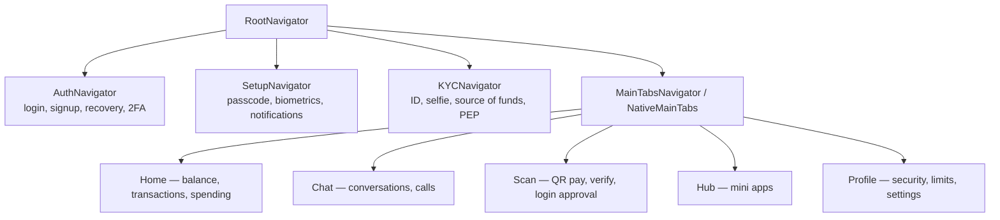

# 7. The Mobile Application

The consumer client is the primary artefact: 103,132 lines of TypeScript across 410 files
and **171 feature screens** under `features/` (plus an animated splash screen in
`components/ui/`), built with React Native 0.86 and Expo SDK 57. It now also embeds a
**watchOS companion** (§7.7), which ships inside the iOS build rather than as a separate
deployable.

## 7.1 Architecture

```
aza/src/
├── features/      Feature-sliced screens — 16 domains (see §7.2)
├── navigation/    Root → Auth | Setup | KYC | MainTabs navigator hierarchy
├── providers/     13 React context providers (§7.3)
├── store/         32 Zustand stores (§7.4), account-scoped (§7.4a)
├── hooks/         16 shared hooks (useWallet, useChat, useTransactions, useWatchSync, …)
├── services/      api.ts (axios instance), webrtcService, callAudioService, historySync
├── native/        Optional-native-module wrappers (§7.5) — webrtc, incallManager, viewShot
├── crypto/        Keystore, media crypto, backup crypto, codecs, CSPRNG, and the
│                  E2EE decrypt path retained for pre-2026-09-02 history (§6.3)
├── modules/       aza-watch — a local Expo module bridging WatchConnectivity (§7.7)
├── targets/       watch, watch-widget, watch-tests — Swift, generated into the Xcode
│                  project by @bacons/apple-targets at prebuild time (§7.7)
├── components/    Shared UI + chat components + miniapp host
├── theme/         Design tokens (dark default, lime #B7EE7A accent)
├── lib/, utils/   Validation, formatting, error mapping, category inference
└── types/         Shared TypeScript contracts
```

The organising principle is **feature-sliced architecture**: each feature owns its screens
and its local state, and shares only through `store/`, `hooks/`, `components/` and
`services/`. Justify it against the alternative (layer-first: all screens in `screens/`,
all state in `state/`) — at 171 screens, a layer-first tree makes every feature a
cross-directory scavenger hunt, and it makes ownership and deletion much harder.

### Navigation hierarchy



`NativeMainTabs` uses `react-native-bottom-tabs` to render **platform-native** tab bars
(UITabBar on iOS, BottomNavigationView on Android) rather than a JS-drawn bar. Worth a
sentence in the thesis: it is the difference between an app that looks cross-platform and
one that feels native, and it is the reason for the tab-spacing fix commits in the history.

## 7.2 Feature domains and screen counts

| Feature | Screens | What it covers |
|---|---|---|
| `auth` | 34 | Login (phone/email), 12-step signup, password reset, TOTP/recovery-code/contact-recovery/app-approval login, deactivated-account, geo-block, new-device |
| `chat` | 16 | Conversations, media preview, camera, audio + video call, incoming call, chat info, themes, backup, storage management, shared/starred/saved messages, broadcast, message info |
| `profile` | 33 | Personal details, appearance, notification settings, limits and usage, limit-increase request, wallet freeze, and the full security-and-privacy tree (2FA setup/disable for each method, passkeys, devices, recovery codes and contacts, connected apps, payment mandates, bill forwarding, delete account, logout everywhere, find-me-by) |
| `transfer` | 15 | Send flow (contact → amount → confirm → PIN → success), bulk transfer, request money, recurring transfers, spending, budgets, financial dashboard, AI assistant |
| `kyc` | 14 | ID type, ID front/back scan, selfie and face verification, source of funds, success/rejected, and the five-screen PEP flow |
| `scan` | 10 | QR scan, my code, merchant checkout, OAuth payment approval, QR-login approval, payment proof, and three public-verification result screens |
| `home` | 6 | Home, transactions, spending categories, statement download, withdraw, reversal request |
| `hub` | 11 | Hub, mini-app player, mandate approval, and the 8-screen in-app merchant KYB onboarding |
| `customercare` | 6 | Help and support, help topics, chat with us, chatbot, email us, talk to us |
| `security` | 4 | App lock, create/verify/reset passcode |
| `splits` | 4 | Splits list, create split, split detail, recurring splits |
| `contacts` | 4 | Contacts, profile, add friends, pending requests |
| `bills` | 3 | Bills, pay bill, receipt |
| `akyede` | 3 | Create gift, my gifts, open gift |
| `onboarding` | 5 | Intro, creating account, account ready, enable biometrics, fees and limits |
| `notifications` | 2 | Inbox, enable notifications |

## 7.3 Cross-cutting providers

Thirteen context providers compose the app shell. The interesting property is that they
are ordered: E2EE cannot initialise before auth resolves a `userId` and `deviceId`, and
the sockets cannot connect before E2EE has a keystore. `AuthProvider` additionally gates
account-scoped storage (§7.4a) and the watch bridge (§7.7), both of which need a resolved
account before they may read or push anything.

| Provider | Responsibility |
|---|---|
| `AuthProvider` | Token lifecycle, refresh rotation, `authEvents` bus for forced logout |
| `SecurityProvider` | App-lock state, passcode gate, biometric prompt |
| `E2EEProvider` | Identity/pre-key generation, publication, rotation, safety numbers |
| `ChatSocketProvider` / `CallSocketProvider` | STOMP connections with reconnect/backoff |
| `PresenceProvider` | Online status heartbeat |
| `NotificationProvider` | FCM registration, Notifee display, deep-link routing |
| `NetworkProvider` | Connectivity via NetInfo; offline banners and queueing |
| `KYCProvider`, `ProfileProvider`, `SignUpProvider` | Multi-step flow state that must survive screen changes |
| `DisplayProvider`, `ToastProvider` | Theme/appearance and transient feedback. `DisplayProvider` also owns `balanceHiddenByDefault`, which travels to the watch in the snapshot (§7.7) |

## 7.4 State management

**Zustand** for client state (32 stores) and **TanStack Query** for server cache. The split
is the standard one and easy to defend: Query owns anything the server is the source of
truth for (balance, transactions, contacts) with caching, retry and invalidation for free;
Zustand owns anything the client is the source of truth for (drafts, pins, reactions, read
receipts, chat lock, backup keys).

Notable stores:

| Store | Why it exists |
|---|---|
| `encryptedMessageStore` | Ciphertext-at-rest for the local message database |
| `sessionCache`, `sessionRootCache`, `peerIdentityCache` | X3DH root-key and peer-identity caching so only the first message per peer pays the handshake cost |
| `backupKeyStore` | Custody of the user-held recovery key |
| `chatLockStore` | Per-conversation lock |
| `scheduledMessagesStore`, `draftStore`, `pinnedMessageStore`, `reactionStore`, `readReceiptsStore`, `pollStore`, `starredMessagesStore`, `savedMessagesStore` | Messenger-grade chat features |
| `transferStore` | The multi-screen send flow's in-progress state |
| `settledRequestsStore` | Prevents a settled money request being acted on twice from a stale screen |
| `accountSession`, `persistence`, `eventCursor`, `legacyStorageCleanup` | Account scoping and the durable event cursor (§7.4a) |

### 7.4a Account-scoped persistence — a multi-user bug class removed

`bbc22eb5` migrated every persisted store from a global storage key to one namespaced by
account. The defect class this closes is worth naming, because it is specific to
phone-first markets and easy to miss on a developer's single-account device: **a shared
phone, or a user with a personal and a business account, would see the previous account's
drafts, pinned chats, themes, read receipts and starred messages after switching.** Some of
those are cosmetic; a draft message addressed to the wrong person is not.

Three parts, and the third is the one usually forgotten:

1. `persistence.ts` centralises key derivation, so a store cannot accidentally persist
   globally — the same chokepoint argument as `WalletLedger` (§5.4a), applied to storage.
2. `accountSession.ts` owns the current account identity and the switch, so a store never
   reads a key for an account that is halfway through changing.
3. `legacyStorageCleanup.ts` removes the pre-migration global keys. Without it the old data
   sits in storage indefinitely — invisible, still readable by anything that constructs the
   old key, and a data-retention question at deletion time.

`eventCursor.ts` is the client half of `WebSocketEventLog` (§4.5): it records the last
Redis-Stream entry id the device has seen, per account, so a reconnect replays from that
point rather than refetching a conversation. It is account-scoped for the same reason —
replaying one account's cursor against another's stream is meaningless.

Covered by `accountSession.test.ts` and `sessionRootCache.test.ts`.

## 7.5 Notable client-side engineering

- **Offline resilience.** NetInfo-driven connectivity state, TanStack Query cache as the
  offline read path, and queued sends.
- **OTA updates.** `expo-updates` — critical for a fintech where a client-side bug must be
  fixable without a store review cycle. Discuss the constraint: OTA can only ship JS, so
  native-module changes still need a store submission.
- **Media pipeline.** `expo-image-picker`/`camera` → `expo-image-manipulator`
  (resize/compress) → `mediaCrypto.encryptMedia` → upload → `useDecryptedMediaUri` for
  transparent decryption at render time. The per-file key now travels in the message's
  server-readable body rather than an E2EE envelope (§6.3), so any device on the account
  can open the media.
- **WebRTC calling.** `react-native-webrtc` + `react-native-incall-manager` for audio
  routing and proximity, signalling over the app's existing STOMP socket, TURN credentials
  minted server-side with an HMAC and a TTL, relayed by coturn (§4.5).
- **Optional native modules (`src/native/`).** WebRTC, in-call management and view-shot are
  each wrapped so the app degrades to a stub in Expo Go rather than crashing at import. This
  exists because the SDK 57 bump stubbed the WebRTC media layer out entirely for Expo Go and
  it stayed stubbed in development builds too (`04948424`) — the wrapper makes the
  Expo-Go/dev-client distinction explicit at one boundary instead of implicit at twenty call
  sites. `expoGo.ts` is the single predicate.
- **Screen-capture prevention** on sensitive screens via `usePreventScreenCapture`.
- **Store compliance.** The repo carries `docs/STORE_DATA_DISCLOSURES.md`,
  `docs/STORE_REVIEW_NOTES.md`, `docs/IPAD_OPTIMIZATION.md` and an
  `app-store-audit` review skill — evidence of a real submission process, not a prototype.

### Sockets that lie about being connected — three variants of one bug

The most instructive cluster of client-side defects in the project's history, because the
same root cause produced three different user-visible symptoms in three different
subsystems, and none of them is reachable by a unit test.

**The root cause.** `stompjs` sets `connected` from the CONNECTED frame and clears it on a
close event. A socket the OS kills while the app is suspended — or that the network drops
silently — never produces that close event. `connected` therefore stays `true` on a dead
socket, and every `if (client.connected)` guard in the codebase silently does the wrong
thing. The library is not at fault; a userspace library cannot observe a connection the
kernel has already discarded.

| Subsystem | Symptom | Fix |
|---|---|---|
| **Calls** (`24ee0908`) | Incoming calls were delivered to a socket that only looked alive, so the phone never rang | Heartbeat ack with a 4-second tolerance — tight, because the user is watching |
| **Chat** (`69efc79a`) | Messages stopped arriving while the UI looked perfectly healthy: the foreground handler's `if (!client.connected)` guard skipped the reconnect, and since resync only rode on `onConnect`, nothing asked the server what was missed either | Resync on **every** foreground rather than only after a reconnect, plus resync on screen focus |
| **Presence** (`9f352902`) | Users showed offline to their chat partners while sitting in the app with it open | Subscribe to the heartbeat ack the server had always sent; 10-second silence rebuilds the socket |

Three details are worth drawing out for the thesis:

1. **The presence failure was unrecoverable, not merely transient.** `PresenceProvider` is
   the only thing in the system that refreshes the server's presence TTL — the chat and call
   sockets never touch it. Every 30-second heartbeat went nowhere silently, the Redis key
   lapsed after 65s, the sweeper flipped the user OFFLINE and fanned that out, and *nothing
   could recover it*, because the only thing that could mark them online again was the
   heartbeat dropping into the void. A liveness mechanism whose own failure is invisible to
   it has no floor.
2. **The server had always acked, and the call socket was already using that ack.** The
   mechanism needed to detect the zombie existed and was in use one directory away. This is
   the client-side twin of the §12.8 observation about `AgentCashService` and `ChatService`:
   the correct pattern was already in the codebase, and the gap was that nothing forced its
   adoption.
3. **The tolerances differ deliberately** — 4 seconds for calls, 10 for presence — because
   one fires on something the user is actively watching and the other on a timer. Reporting
   the reasoning rather than just the constants is what makes it an engineering decision
   rather than a magic number.

The chat resync is also a small, citable efficiency argument: asking for a resync on every
foreground sounds wasteful, but it is one frame answered from the client's cursor in the
durable event log (§4.5), so the ordinary "nothing missed" case costs an empty reply rather
than a history fetch.

## 7.6 Design system

From `PRODUCT.md`, which is a genuine design specification and should be quoted in the
thesis rather than paraphrased:

- **Target user:** 18–35 in Ghana and across Africa, phone-first, transacting daily.
- **Positioning by negation** — explicit anti-references: not Wave/Chipper's navy-and-gold
  "African fintech template", not Cash App's personality-free black-and-green, not generic
  SaaS scaffolding, not Web3 purple gradients. Designing against named alternatives is a
  defensible design method; cite it as such.
- **Palette:** dark as the default voice; lime `#B7EE7A` as the single expressive accent,
  used surgically.
- **Accessibility floor:** WCAG AA. `prefers-reduced-motion` respected throughout with an
  instant-reveal fallback for every animation. Lime on dark green `#174717` passes 4.5:1
  for body text. All interactive elements carry a visible focus ring.

The same tokens are the default mini-app theme (`miniapps/types.ts`), so an embedded app
inherits the host's look unless it opts out.

## 7.7 The watchOS companion

A read-only Apple Watch app plus three WidgetKit complications (`4d31228e`, `90c62548`).
Scope was fixed in advance and held: **read-only, glanceable, no money movement, no chat, no
credentials on the wrist.**

### Phone-authoritative architecture

The watch **never authenticates and never calls the API.** The phone pushes a
`WalletSnapshot` as the WatchConnectivity *application context*, which is the correct
primitive of the three available and worth justifying explicitly:

| Primitive | Why not |
|---|---|
| `transferUserInfo` | Replays a queue in order. We want the newest balance, not every balance the phone ever had |
| `sendMessage` | Requires the phone app to be reachable in the foreground |
| **`updateApplicationContext`** | **Latest-value-wins, delivered opportunistically. Exactly the semantics of "current balance"** |

A refresh request from the watch is answered from cache immediately, then forwarded to JS,
which owns the API client and the react-query cache; the fresher value follows as an
ordinary context update. Keeping the credential and the network client on the phone is what
makes "no credentials on the wrist" a structural property rather than a policy.

### The App Group boundary

The watch writes each snapshot into its own App Group container. A WidgetKit complication
runs in a **separate process** and can read neither the app's memory nor its `WCSession`, so
persisting through a shared container is what makes the complication a UI addition rather
than a re-architecture.

Note which device's group it is: App Groups are shared between an app and its extensions on
**one device**, and the watch is a separate device — so the group belongs to the watch, and
the phone neither needs nor is granted one. This is the kind of detail that is obvious in
retrospect and expensive to discover late.

### Two decisions taken from the codebase rather than invented

1. **Balance privacy travels in the snapshot.** The phone already has
   `balanceHiddenByDefault` (`DisplayProvider`), rendered as `••••` by `HomeScreen`. That
   preference rides along instead of being asked again, and transaction amounts conceal
   *with* it — hiding the total while listing every amount beside it would defeat the point.
   Reveal is per-launch and never persisted.
2. **watchOS 9.4, matched to the iOS floor of 16.4 rather than raised.** watchOS 10 requires
   a phone on iOS 17, so a higher floor would strand users the phone app still supports. The
   watch's minimum is a function of the phone's, not an independent choice.

### The UI states its own staleness

"Updated 09:14", turning orange past fifteen minutes. iOS delivers an application context on
its own schedule, so a wrist raise hours after the phone last ran shows a balance that old.
**A stale figure that passes for a live one is worse than one that admits its age** — a
general principle for glanceable financial UI, and the reason the design does not simply
show a number.

### Two build-system findings worth recording

Both cost real time and neither is documented anywhere obvious:

1. **`ios/` and `android/` are gitignored and regenerated by `expo prebuild`.** A watch
   target added by hand in Xcode survives until the next prebuild and never exists in an EAS
   build at all. The target is therefore *generated* from `targets/watch/` by the
   `@bacons/apple-targets` config plugin, and verified to survive `expo prebuild --clean`
   alongside the three existing custom plugins. The original plan document asserted the
   project was "already bare, which helps"; it was not, and that was the assumption that
   mattered most.
2. **A hand-written local Expo module needs a `.podspec` in its `ios/` folder.** Without
   one, autolinking still finds the module and lists it in
   `expo-modules-autolinking search`, but CocoaPods never builds it, nothing lands in
   `Podfile.lock`, and `requireOptionalNativeModule` returns `null` on device — silent in
   both directions.

### Verification status, stated honestly

`expo prebuild --clean` yields both the `aza` and `watch` targets; `AzaWatch` appears in
`Podfile.lock` and `ExpoModulesProvider.swift`; the TypeScript half is covered by
`useWatchSync.test.ts` and `watchSchemaParity.test.ts` — the latter asserting that the
Swift `WalletSnapshot` and the TypeScript payload agree field-for-field, which is the only
automated check possible across that language boundary. `WalletSnapshotTests.swift` and
`QRCodeTests.swift` exist for the Swift side.

**Nothing has been compiled for watchOS.** The platform is not installed in the development
Xcode (the SDK is present, the platform components are not), which also blocks building the
iOS scheme now that it embeds a watch app; `xcodebuild -downloadPlatform watchOS` is a
one-time prerequisite for either. Report this as an untested-on-device component rather than
implying a shipped watch app — it is the honest position and it is a small, specific
limitation.
