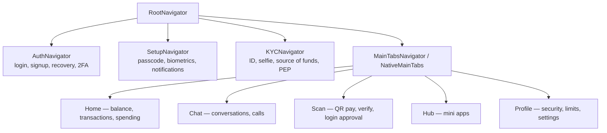

# 7. The Mobile Application

The consumer client is the primary artefact: 98,733 lines of TypeScript across 387 files
and **170 feature screens** under `features/` (plus an animated splash screen in `components/ui/`), built with React Native 0.86 and Expo SDK 57.

## 7.1 Architecture

```
aza/src/
├── features/      Feature-sliced screens — 16 domains (see §7.2)
├── navigation/    Root → Auth | Setup | KYC | MainTabs navigator hierarchy
├── providers/     14 React context providers (§7.3)
├── store/         31 Zustand stores (§7.4)
├── hooks/         13 shared hooks (useWallet, useChat, useTransactions, …)
├── services/      api.ts (axios instance), webrtcService, callAudioService, historySync
├── crypto/        E2EE, keystore, media crypto, backup crypto, codecs, CSPRNG
├── components/    Shared UI + chat components + miniapp host
├── theme/         Design tokens (dark default, lime #B7EE7A accent)
├── lib/, utils/   Validation, formatting, error mapping, category inference
└── types/         Shared TypeScript contracts
```

The organising principle is **feature-sliced architecture**: each feature owns its screens
and its local state, and shares only through `store/`, `hooks/`, `components/` and
`services/`. Justify it against the alternative (layer-first: all screens in `screens/`,
all state in `state/`) — at 170 screens, a layer-first tree makes every feature a
cross-directory scavenger hunt, and it makes ownership and deletion much harder.

### Navigation hierarchy



`NativeMainTabs` uses `react-native-bottom-tabs` to render **platform-native** tab bars
(UITabBar on iOS, BottomNavigationView on Android) rather than a JS-drawn bar. Worth a
sentence in the thesis: it is the difference between an app that looks cross-platform and
one that feels native, and it is the reason for the tab-spacing fix commits in the history.

## 7.2 Feature domains and screen counts

| Feature | Screens | What it covers |
|---|---|---|
| `auth` | 34 | Login (phone/email), 12-step signup, password reset, TOTP/recovery-code/contact-recovery/app-approval login, deactivated-account, geo-block, new-device |
| `chat` | 16 | Conversations, media preview, camera, audio + video call, incoming call, chat info, themes, backup, storage management, shared/starred/saved messages, broadcast, message info |
| `profile` | 33 | Personal details, appearance, notification settings, limits and usage, limit-increase request, wallet freeze, and the full security-and-privacy tree (2FA setup/disable for each method, passkeys, devices, recovery codes and contacts, connected apps, payment mandates, bill forwarding, delete account, logout everywhere, find-me-by) |
| `transfer` | 15 | Send flow (contact → amount → confirm → PIN → success), bulk transfer, request money, recurring transfers, spending, budgets, financial dashboard, AI assistant |
| `kyc` | 14 | ID type, ID front/back scan, selfie and face verification, source of funds, success/rejected, and the five-screen PEP flow |
| `scan` | 10 | QR scan, my code, merchant checkout, OAuth payment approval, QR-login approval, payment proof, and three public-verification result screens |
| `home` | 6 | Home, transactions, spending categories, statement download, withdraw, reversal request |
| `hub` | 11 | Hub, mini-app player, mandate approval, and the 8-screen in-app merchant KYB onboarding |
| `customercare` | 6 | Help and support, help topics, chat with us, chatbot, email us, talk to us |
| `security` | 4 | App lock, create/verify/reset passcode |
| `splits` | 4 | Splits list, create split, split detail, recurring splits |
| `contacts` | 4 | Contacts, profile, add friends, pending requests |
| `bills` | 3 | Bills, pay bill, receipt |
| `akyede` | 3 | Create gift, my gifts, open gift |
| `onboarding` | 5 | Intro, creating account, account ready, enable biometrics, fees and limits |
| `notifications` | 2 | Inbox, enable notifications |

## 7.3 Cross-cutting providers

Fourteen context providers compose the app shell. The interesting property is that they
are ordered: E2EE cannot initialise before auth resolves a `userId` and `deviceId`, and
the sockets cannot connect before E2EE has a keystore.

| Provider | Responsibility |
|---|---|
| `AuthProvider` | Token lifecycle, refresh rotation, `authEvents` bus for forced logout |
| `SecurityProvider` | App-lock state, passcode gate, biometric prompt |
| `E2EEProvider` | Identity/pre-key generation, publication, rotation, safety numbers |
| `ChatSocketProvider` / `CallSocketProvider` | STOMP connections with reconnect/backoff |
| `PresenceProvider` | Online status heartbeat |
| `NotificationProvider` | FCM registration, Notifee display, deep-link routing |
| `NetworkProvider` | Connectivity via NetInfo; offline banners and queueing |
| `KYCProvider`, `ProfileProvider`, `SignUpProvider` | Multi-step flow state that must survive screen changes |
| `DisplayProvider`, `ToastProvider` | Theme/appearance and transient feedback |

## 7.4 State management

**Zustand** for client state (31 stores) and **TanStack Query** for server cache. The split
is the standard one and easy to defend: Query owns anything the server is the source of
truth for (balance, transactions, contacts) with caching, retry and invalidation for free;
Zustand owns anything the client is the source of truth for (drafts, pins, reactions, read
receipts, chat lock, backup keys).

Notable stores:

| Store | Why it exists |
|---|---|
| `encryptedMessageStore` | Ciphertext-at-rest for the local message database |
| `sessionCache`, `sessionRootCache`, `peerIdentityCache` | X3DH root-key and peer-identity caching so only the first message per peer pays the handshake cost |
| `backupKeyStore` | Custody of the user-held recovery key |
| `chatLockStore` | Per-conversation lock |
| `scheduledMessagesStore`, `draftStore`, `pinnedMessageStore`, `reactionStore`, `readReceiptsStore`, `pollStore`, `starredMessagesStore`, `savedMessagesStore` | Messenger-grade chat features |
| `transferStore` | The multi-screen send flow's in-progress state |
| `settledRequestsStore` | Prevents a settled money request being acted on twice from a stale screen |

## 7.5 Notable client-side engineering

- **Offline resilience.** NetInfo-driven connectivity state, TanStack Query cache as the
  offline read path, and queued sends.
- **OTA updates.** `expo-updates` — critical for a fintech where a client-side bug must be
  fixable without a store review cycle. Discuss the constraint: OTA can only ship JS, so
  native-module changes still need a store submission.
- **Media pipeline.** `expo-image-picker`/`camera` → `expo-image-manipulator`
  (resize/compress) → `mediaCrypto.encryptMedia` → upload → `useDecryptedMediaUri` for
  transparent decryption at render time.
- **WebRTC calling.** `react-native-webrtc` + `react-native-incall-manager` for audio
  routing and proximity, signalling over the app's existing STOMP socket, TURN credentials
  minted server-side with an HMAC and a TTL.
- **Screen-capture prevention** on sensitive screens via `usePreventScreenCapture`.
- **Store compliance.** The repo carries `docs/STORE_DATA_DISCLOSURES.md`,
  `docs/STORE_REVIEW_NOTES.md`, `docs/IPAD_OPTIMIZATION.md` and an
  `app-store-audit` review skill — evidence of a real submission process, not a prototype.

## 7.6 Design system

From `PRODUCT.md`, which is a genuine design specification and should be quoted in the
thesis rather than paraphrased:

- **Target user:** 18–35 in Ghana and across Africa, phone-first, transacting daily.
- **Positioning by negation** — explicit anti-references: not Wave/Chipper's navy-and-gold
  "African fintech template", not Cash App's personality-free black-and-green, not generic
  SaaS scaffolding, not Web3 purple gradients. Designing against named alternatives is a
  defensible design method; cite it as such.
- **Palette:** dark as the default voice; lime `#B7EE7A` as the single expressive accent,
  used surgically.
- **Accessibility floor:** WCAG AA. `prefers-reduced-motion` respected throughout with an
  instant-reveal fallback for every animation. Lime on dark green `#174717` passes 4.5:1
  for body text. All interactive elements carry a visible focus ring.

The same tokens are the default mini-app theme (`miniapps/types.ts`), so an embedded app
inherits the host's look unless it opts out.
