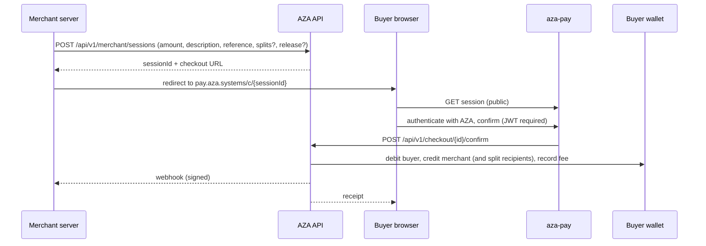

# 9. The Developer Platform

AZA is not only an app; it is a platform with four distinct third-party integration
surfaces. This chapter is a strong differentiator for the thesis — most student fintech
projects stop at the consumer app.

## 9.1 Merchant API (server-to-server)

**Authentication:** `X-Api-Key` header. Two key classes, and the distinction is
load-bearing:

| Prefix | Behaviour |
|---|---|
| `aza_live_…` | Moves real money |
| `aza_test_…` | **Sandbox — validates everything, moves no money.** |

Keys can be **restricted** with scopes (e.g. `transfers:read`, `transfers:write`); full
secret keys have access to everything. `MerchantApiKeyFilter` authenticates the key,
resolves the merchant principal, and skips entirely if a valid JWT already authenticated
the request — so the merchant portal and a server integration share the same controllers
without ambiguity about who is acting.

Supporting entities: `MerchantApiKey`, `MerchantApiLog` (per-call logging),
`MerchantAuditLog`, `WebhookEndpoint`, `WebhookDelivery`.

Published surface (`springdoc.paths-to-match`): `/api/v1/merchant/**`,
`/api/v1/checkout/**`, `/api/v1/developer/**`, `/oauth/**`. A Postman collection ships at
`docs/AZA_Backend.postman_collection.json`.

## 9.2 Hosted checkout



Notable properties:
- **GET on a session is public**; confirm and cancel require an authenticated JWT
  (`SecurityConfig`). This is what lets the page render before the buyer logs in.
- **Idempotency is scoped per merchant** (`V43`), not globally.
- **Test mode** propagates through the session (`V32__checkout_session_test_mode.sql`) so a
  sandbox session can traverse the entire flow without moving value.
- Discount codes validate at a **public** endpoint (`POST /api/v1/checkout/discount/validate`)
  because the buyer applies them pre-authentication.
- `CheckoutRefundSplitTest` covers the hard case: refunding a payment that was split.

## 9.3 AZA Connect — marketplace payments

Full guide: `docs/AZA_CONNECT.md`; partner kit at `docs/aza-connect-partner-kit/`.

The problem Connect solves: a marketplace wants buyers to pay from their AZA accounts and
sellers to receive into theirs, **without every seller becoming an AZA merchant**. The
platform integrates as a single merchant (one KYB, one wallet, one set of keys) and stays
the merchant of record; sellers are ordinary AZA users identified by email or username.

**Two settlement models:**

**A — Split at checkout** (automatic, at the moment of sale):
```
Buyer pays 100 GHS
  ├─ seller wallet   +85.00   (credited instantly)
  ├─ platform keeps  +13.50
  └─ AZA fee          +1.50   (1.5%)
```
The sum of splits must not exceed the amount **after** the AZA fee; the platform keeps the
remainder. Entity: `CheckoutSessionSplit`.

**B — Direct transfer** (collect first, pay sellers later):
```
Buyer pays 100 GHS → platform balance +98.50
  … later, on the platform's own schedule …
POST /connect/transfers { recipient, amount: 85 }
  → platform balance −85 → seller wallet +85
```
Entity: `ConnectTransfer`, with `UNIQUE (merchant_id, idempotency_key)`.

Split is best when the seller is known at checkout; transfers are best for payout runs,
adjustments and clawbacks. Scope is explicitly stated in the guide: **Ghana only, GHS only,
v1**.

Compare with Stripe Connect in the thesis: Stripe onboards sellers as sub-merchants
(Express/Custom accounts) with their own KYC; AZA v1 deliberately does not, trading
regulatory reach for integration simplicity — the seller needs nothing but an AZA account.
That trade-off, and its limits, is a good discussion point.

## 9.4 Sign in with AZA — OAuth 2.0

Full guide: `SIGN_IN_WITH_AZA.md`. Two flows.

### Standard Authorization Code + PKCE
For web and mobile clients. Endpoints: `/oauth/authorize`, `/oauth/approve`,
`/oauth/token`, `/oauth/userinfo`, `/oauth/revoke`. Consent screen at
`aza.systems/oauth/consent`. Entities: `OAuthClient`, `OAuthAccessToken`.

### QR login flow — the distinctive one
For desktop, smart TV and kiosk clients where the user cannot type a password:

```
Your server                    AZA backend            AZA mobile app
    │── POST /oauth/qr/initiate ───▶│                       │
    │◀── QR PNG + challengeToken ───│                       │
    │  [display QR]                 │◀─ user scans QR ──────│
    │                               │◀─ user taps Approve ──│
    │── GET  /oauth/qr/status ─────▶│                       │
    │◀── { status: "APPROVED" } ────│                       │
    │── POST /oauth/qr/complete ───▶│                       │
    │◀── access_token + refresh ────│                       │
```

Security properties to point out:
- The QR session lives **90 seconds**.
- `sessionSecret` is returned to the integrating **server** and must never reach the
  browser — it is what authorises the final `complete` call, so a hijacked QR alone is
  useless.
- `POST /api/v1/auth/qr-login/authorize` is one of the few `/auth/**` paths explicitly
  marked `authenticated()`: the approving mobile user must already be logged in.
- Client secrets are shown **once** and rotate via
  `POST /api/v1/developer/clients/{clientId}/rotate-secret`.

### Scopes
`identity` (name, username, avatar), `email`, and payment scopes for delegated charging.

### Delegated payment and mandates
Beyond identity, a third party can charge a user:
- **One-off:** `OAuthPaymentController` — the user approves in-app
  (`OAuthPaymentApprovalScreen`).
- **Recurring:** `PaymentMandate` + `MandateCharge` (`V48__payment_mandates.sql`). The user
  approves a mandate carrying the merchant name, **ceilings** and **cadence** on the
  hosted page `pay.aza.systems/m/{mandateId}` or in-app (`MandateApprovalScreen`), and can
  review and revoke it later (`PaymentMandatesScreen`). Execution is
  `MandateChargeExecutor`, audited by `MandateChargeAuditService`.

This is the platform's answer to card-on-file recurring billing without cards: a
user-authorised, bounded, revocable standing authority. Present it as such.

## 9.5 Mini Apps

Third-party applications embedded in the AZA client — the super-app surface.

### Runtime model
A mini app is a web bundle rendered in a WebView (`MiniAppPlayerScreen`). The native app
injects `window.aza`; the developer ships no runtime code. The published SDK
(`@az-spaces/aza-miniapp-sdk` / `@jumpspaces/aza-miniapp-sdk`) provides only TypeScript
types and helpers:

```ts
import { waitForAza } from '@jumpspaces/aza-miniapp-sdk';
const aza = await waitForAza();
const user = await aza.getUser();
```

### Permission and consent model

Permissions are declared at **submission** time and shown on a consent sheet the first time
the user opens the app.

| Permission | Grants |
|---|---|
| `USER_PROFILE` | username, first/last name, avatar — **implicit**, always included |
| `USER_PHONE` | phone number |
| `USER_EMAIL` | email address |
| `MAKE_PAYMENTS` | `aza.requestPayment()` |
| `READ_BALANCE` | `aza.getBalance()` |
| `READ_TRANSACTIONS` | transaction history (not yet available) |

Design properties worth citing:
- **Least privilege is enforced by review**, not just advised — apps requesting
  permissions without a clear purpose are rejected.
- **Deny is a first-class outcome.** SDK calls for denied permissions throw; the guide
  requires developers to handle it rather than assume consent.
- **Consent is revocable** from AZA profile settings; the record is `MiniAppConsent`.
- The mini app never touches the wallet directly — it *requests* a payment, and the
  native host renders AZA's own confirmation UI. The trust boundary is the bridge.

### Lifecycle and governance
`MiniApp` (registry, `V14`), `MiniAppStatus` (`V13`), `DisabledMiniApp` (`V11`, a kill
switch), `MiniAppReport` (user reporting), submission through the merchant portal,
review and approval through `aza-admin`, catalogue sync via `MiniAppCatalog`.

### Self-hosting bundles — an infrastructure contribution
Originally developers needed their own domain and HTTPS host. `V49__miniapp_bundle_hosting.sql`
plus `MiniAppBundleService` let AZA host the bundle itself:

1. The developer uploads a zipped web build (React, Vite, or an Expo/React Native **web
   export** — `docs/08-expo-and-react-native.md` covers this).
2. The backend extracts it into the shared `miniapp_bundles` volume, bounding the
   **uncompressed** size (`aza.miniapps.max-uncompressed-bytes`) as the real defence
   against a decompression bomb.
3. nginx serves it read-only from `/srv/miniapps`.
4. Each app is served from **its own origin, one DNS label deep**:
   `<app>-mini.aza.systems` live, `<app>-mini-preview.aza.systems` while in review. One
   origin per app is what stops any mini app reading another's `localStorage`, IndexedDB,
   cookies or service workers. Keeping it one label deep is what keeps it inside
   Cloudflare's free `*.aza.systems` certificate (see §4.6). `current` and `preview` are
   symlinks the service swaps atomically, so publishing and rolling back never rewrite a
   file nginx is reading.

Reference apps in `miniapps/`: `play-2048`, `snake`, `connect4`, `radio`, `notepad`,
`cedirates`, `salifu-and-master` — a mix of games, utilities and a Ghana-specific FX-rate
app, all built against the public SDK, which is itself the proof the SDK is usable.

## 9.6 Webhooks

`WebhookEndpoint` + `WebhookDelivery` + `WebhookService`, managed from the merchant portal
and observable in `aza-admin`. Verified implementation:

| Property | Implementation |
|---|---|
| **Signature** | HMAC-SHA256 over the raw payload with the endpoint's `signingSecret`, sent as `X-Aza-Signature: sha256=<hex>` |
| **Correlation headers** | `X-Aza-Event` (event type), `X-Aza-Delivery` (delivery UUID — lets the consumer deduplicate idempotently) |
| **Retry schedule** | 7 attempts at **5s → 30s → 5m → 30m → 2h → 6h → 24h**, then marked `ABANDONED` |
| **Success criterion** | HTTP 2xx; anything else schedules a retry |
| **Timeouts** | 10s connect, 15s request |
| **Persistence** | Every attempt recorded on `WebhookDelivery`: attempt count, last attempt, response status, first 500 bytes of the response body |
| **Subscription** | Opt-in per endpoint — an event is delivered only if the endpoint's `events` list names it or is `*` |
| **SSRF guard** | `validateWebhookUrl` requires HTTPS and rejects any URL resolving to a loopback, site-local, link-local or any-local address |

**The SSRF guard deserves a paragraph in the security chapter, not just this table.** A
webhook endpoint is a user-supplied URL that the *server* then fetches — the textbook
server-side request forgery primitive. Rejecting private address space stops a merchant
pointing an endpoint at `169.254.169.254` (cloud instance metadata) or at an internal
service reachable only from the application host.

Note the residual weakness for completeness: the guard resolves the hostname once, and the
HTTP client resolves it again when the request is made. A DNS-rebinding attacker controlling
the authoritative nameserver could return a public address for the first lookup and a
private one for the second. Closing it properly requires resolving once and connecting to
the validated IP directly (pinning the socket address), which is a known and citable
hardening step for future work.
